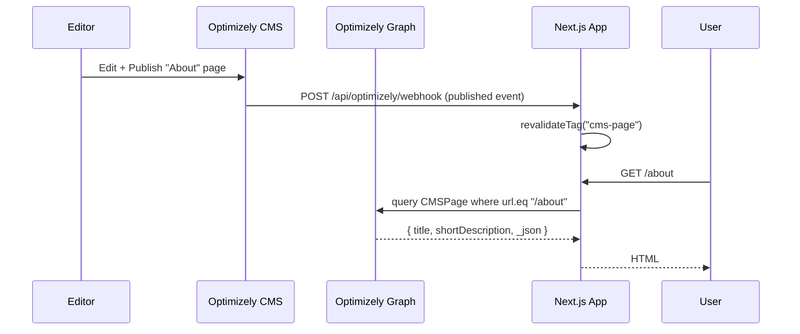

# Connecting a Next.js App to Optimizely SaaS CMS — Beginner Guide

**Audience:** A new developer who already has
- A working Next.js (App Router) app running locally.
- Optimizely SaaS CMS access, and has read the *Optimizely SAAS CMS Developer Guide* PDF (knows how to enable Preview, create the App in CMS, define Content Types, and create Pages).

**Goal:**
1. Wire your Next.js app to Optimizely Graph (the read API).
2. Render a CMS Page at a Next.js URL.
3. Publish/edit in Optimizely → see the change in the app.

You do **not** need to build the full reference site to do this. Start with the smallest possible page and grow from there.

---

## 0. Mental model (read this first)

Optimizely SaaS CMS gives you three things you must understand:

| Concept | What it is | Where it lives |
|---|---|---|
| **Content Type** | A schema (fields like `title`, `body`). You defined these in the CMS UI. | Optimizely CMS UI |
| **Content Item / Page** | An instance of a Content Type with real values. Has a URL (`_metadata.url.default`). | Optimizely CMS UI |
| **Optimizely Graph** | A hosted GraphQL endpoint that exposes published (and, with auth, draft) content. | `https://cg.optimizely.com` |

Your Next.js app is **just a Graph client**. It:
1. Receives a request like `GET /en/about`.
2. Asks Optimizely Graph: "give me the page whose URL is `/en/about`".
3. Maps the JSON response onto React components and returns HTML.

That is the entire integration. Everything else (preview mode, webhooks, caching) is an optimisation around that loop.

---

## 1. Get the four secrets out of Optimizely

The Graph keys live in the **Optimizely Graph admin**, which on most tenants is reached from the CMS UI under **Settings → API Keys** (sometimes labelled **Render API** or surfaced in a separate Optimizely Graph console). The exact menu path varies by tenant version — your PDF should show the screenshot. You need:

| Value | Used for | Sensitivity |
|---|---|---|
| **Graph Gateway URL** | Base URL for all GraphQL calls. For this repo's tenant it is `https://cg.optimizely.com`. **Confirm yours in the Graph admin** before assuming. | Public |
| **Single key (Render key)** | Read-only key for **published** content. Sent as `?auth=<key>` on the URL. | Semi-public (only used server-side; do not commit it). |
| **App key** | First half of HTTP Basic auth for **draft / preview** reads. | Secret |
| **Secret** | Second half of HTTP Basic auth. | Secret |

You also need your **CMS authoring URL** (e.g. `https://<your-tenant>.cms.optimizely.com`) — only used so you can link "Edit in CMS" buttons later.

> The env-var names (`OPTIMIZELY_RENDER_URL`, `OPTIMIZELY_RENDER_KEY`, `OPTIMIZELY_GRAPH_APP_KEY`, `OPTIMIZELY_GRAPH_SECRET`) are **this repo's convention**, not Optimizely's. Use whatever names you like — they only need to match what your code reads.

> If you can only see one key, that is the Single/Render key. You can still complete Steps 2–5 — preview (Step 6) just won't work until you get the App key + Secret.

---

## 2. Add environment variables to your Next.js app

Create `.env.local` at the project root (do **not** commit it). Add:

```env
# Provider switch — flip to "optimizely" once Step 4 works.
CMS_PROVIDER=optimizely

# Optimizely Graph
OPTIMIZELY_RENDER_URL=https://cg.optimizely.com
OPTIMIZELY_RENDER_KEY=<single key from CMS>
OPTIMIZELY_GRAPH_APP_KEY=<app key>
OPTIMIZELY_GRAPH_SECRET=<secret>

# Preview / on-demand revalidation — pick any random strings
PREVIEW_SECRET=local-preview-secret
REVALIDATE_SECRET=local-revalidate-secret

# Your dev URL
SITE_URL=http://localhost:3000
```

Restart `next dev` after editing `.env.local` — Next.js only reads it at startup.

---

## 3. Write the Graph client (one file, ~60 lines)

Create `src/lib/optimizely.ts`:

```ts
// src/lib/optimizely.ts
type GraphResponse<T> = { data?: T; errors?: Array<{ message: string }> };

function basicAuthHeader() {
  const appKey = process.env.OPTIMIZELY_GRAPH_APP_KEY?.trim();
  const secret = process.env.OPTIMIZELY_GRAPH_SECRET?.trim();
  if (!appKey || !secret) return null;
  return `Basic ${Buffer.from(`${appKey}:${secret}`).toString("base64")}`;
}

export async function fetchGraph<T>(
  query: string,
  opts: { draft?: boolean; tags?: string[] } = {},
): Promise<T | null> {
  const base = process.env.OPTIMIZELY_RENDER_URL?.replace(/\/$/, "");
  const renderKey = process.env.OPTIMIZELY_RENDER_KEY;
  if (!base) return null;

  const url = `${base}/content/v2`;
  const useAdmin = Boolean(opts.draft && basicAuthHeader());

  // Published reads → ?auth=<renderKey>. Draft reads → HTTP Basic.
  const endpoint = useAdmin ? url : `${url}?auth=${encodeURIComponent(renderKey ?? "")}`;

  const res = await fetch(endpoint, {
    method: "POST",
    headers: {
      "Content-Type": "application/json",
      ...(useAdmin ? { Authorization: basicAuthHeader()! } : {}),
    },
    body: JSON.stringify({ query }),
    // Draft must bypass cache. Published can be cached + tag-invalidated.
    cache: opts.draft ? "no-store" : undefined,
    next: opts.draft ? undefined : { revalidate: 60, tags: opts.tags },
  });

  if (!res.ok) {
    console.error("Graph HTTP error", res.status);
    return null;
  }
  const json = (await res.json()) as GraphResponse<T>;
  if (json.errors?.length) {
    console.error("Graph errors", json.errors);
    return null;
  }
  return json.data ?? null;
}
```

Two important details (these trip everyone up):

- **`?auth=<key>` is for the published/public read path.** The Basic-auth path is only used when you ask for drafts.
- **Use `next: { revalidate, tags }` for published content** so the cache is tag-invalidatable. **Use `cache: "no-store"` for drafts** so editors see their unpublished changes immediately.

---

## 4. Smoke test: list your content types

Before writing any UI, prove the connection works. Create `src/app/api/cms-ping/route.ts`:

```ts
import { NextResponse } from "next/server";
import { fetchGraph } from "@/lib/optimizely";

export async function GET() {
  // Replace "CMSPage" with the exact Content Type name you created
  // in the Optimizely UI (case-sensitive, no spaces).
  const data = await fetchGraph<{ CMSPage: { total: number } }>(
    `query { CMSPage(limit: 1) { total } }`,
  );
  return NextResponse.json({ ok: Boolean(data), data });
}
```

> **Don't know your Content Type's exact system name?** Use the schema introspection helper in this repo at [scripts/introspect-graph.ps1](scripts/introspect-graph.ps1). It reads `.env.local` and dumps the type names and available URL filters your tenant accepts. Run `pwsh scripts/introspect-graph.ps1` from the repo root.

Run `npm run dev`, then open `http://localhost:3000/api/cms-ping`.

| What you see | What it means | Fix |
|---|---|---|
| `{ ok: true, data: { CMSPage: { total: <number> } } }` | Connection works. Move on. | — |
| `{ ok: false }` and a 401 in your terminal | `OPTIMIZELY_RENDER_KEY` is wrong. | Re-copy the Single key. |
| `{ ok: false }` and "Cannot query field CMSPage" | Your Content Type isn't called `CMSPage`. | Open CMS UI → check the **system name** of your type. Use that exact string. |
| `{ ok: false }` and a 404 | `OPTIMIZELY_RENDER_URL` is wrong. | Should be your Graph gateway, e.g. `https://cg.optimizely.com`. |

> **The Content Type name in the GraphQL schema = the system/code name you set when creating it.** It is *not* the display name. Optimizely will reject `cmsPage` if you named it `CMSPage`. Get this right once and the rest is easy.

---

## 5. Render an Optimizely page at a Next.js URL

The simplest model: one Next.js catch-all route serves every CMS page.

> **Locale prefix warning — read this before you write the code.** Optimizely stores URLs as `_metadata.url.default`. Most tenants (this one included) include the locale: a page in the `en` site appears as `/en/about`, **not** `/about`. The route below mirrors whatever path appears in the browser into the Graph filter, so if your CMS uses `/en/about` you must visit `http://localhost:3000/en/about`, not `/about`. Use the introspection script from Step 4 (`showAllUrls` query) to see exactly what your tenant returns.

Create `src/app/[[...slug]]/page.tsx`:

```tsx
import { notFound } from "next/navigation";
import { draftMode } from "next/headers";
import { fetchGraph } from "@/lib/optimizely";

type PageItem = {
  title: string | null;
  // Replace shortDescription with whichever field your Content Type actually defines.
  shortDescription: string | null;
  _metadata: { key: string; displayName: string } | null;
  // _json contains the full content tree (blocks, fields, etc.)
  _json: Record<string, unknown> | null;
};

// Crude allow-list so a malicious URL can't inject GraphQL.
// Production code: parametrise the query or escape properly. For a sample, this is fine.
function safePath(slug: string[]) {
  const joined = "/" + slug.filter((s) => /^[a-z0-9\-_]+$/i.test(s)).join("/");
  return joined === "/" ? "/" : joined;
}

async function getPage(slug: string[]) {
  const path = safePath(slug);
  const draft = (await draftMode()).isEnabled;

  // `eq` is the strict match. If your CMS URLs include trailing slashes, try `startsWith`.
  // `like` / `contains` are NOT supported on the default StringFilterInput in Optimizely Graph.
  const data = await fetchGraph<{ CMSPage: { items: PageItem[] } }>(
    `query {
      CMSPage(
        limit: 1,
        where: { _metadata: { url: { default: { eq: "${path}" } } } }
      ) {
        items {
          title
          shortDescription
          _metadata { key displayName }
          _json
        }
      }
    }`,
    { draft, tags: ["cms-page"] },
  );

  return data?.CMSPage?.items?.[0] ?? null;
}

export default async function CatchAll({
  params,
}: {
  params: Promise<{ slug?: string[] }>;
}) {
  const { slug = [] } = await params;
  const page = await getPage(slug);
  if (!page) notFound();

  return (
    <main style={{ padding: 32, fontFamily: "system-ui" }}>
      <h1>{page.title ?? page._metadata?.displayName}</h1>
      {page.shortDescription ? <p>{page.shortDescription}</p> : null}
      {/* Once this renders, you can graph-walk page._json to render blocks. */}
      <pre style={{ background: "#f4f4f4", padding: 16, overflow: "auto" }}>
        {JSON.stringify(page._json, null, 2)}
      </pre>
    </main>
  );
}
```

### Verify

1. In Optimizely, create a page (in whatever Content Type you have) with URL `/en/about` (or `/about` if your tenant is not locale-prefixed), fill in the fields, and **Publish**.
2. Open `http://localhost:3000/en/about` (use the **exact** URL from Step 1).
3. You should see the title and a JSON dump of the page.

If the page is 404:
- Open `/api/cms-ping` from Step 4 — does Graph see *any* pages? If not, the issue is auth, not the renderer.
- Hard-code a smoke query and check the response: `CMSPage(limit: 5) { items { _metadata { url { default } } } }`. Compare those strings to the URL bar of your browser. They must match character-for-character.
- If your fields are different (e.g. `title` doesn't exist on your type), Graph will return `null` for the field but `items[0]` itself will still be present. Adjust the query to your type's fields.

---

## 6. Preview / draft mode (see unpublished edits)

Without this step, editors must Publish to see changes. With it, the **Preview** button in Optimizely opens your Next.js app in draft mode and shows in-progress content.

### a. Create the preview endpoint

`src/app/api/draft/route.ts`:

```ts
import { draftMode } from "next/headers";

export async function GET(req: Request) {
  const url = new URL(req.url);
  const secret = url.searchParams.get("secret");
  const slug = url.searchParams.get("slug") ?? "/";

  if (secret !== process.env.PREVIEW_SECRET) {
    return new Response("Invalid preview secret", { status: 401 });
  }

  (await draftMode()).enable();
  return Response.redirect(new URL(slug, req.url));
}
```

And a disable endpoint, `src/app/api/draft/disable/route.ts`:

```ts
import { draftMode } from "next/headers";
export async function GET(req: Request) {
  (await draftMode()).disable();
  return Response.redirect(new URL("/", req.url));
}
```

### b. Configure the Preview URL in Optimizely

In CMS → Settings → Preview (or your Content Type's Preview tab), set the preview URL to point at your draft endpoint. The exact templating token differs by tenant — common ones are `{path}`, `{slug}`, `{ContentURL}`, or `{url}`. **Use whichever token your PDF / CMS settings page shows.** Example:

```
http://localhost:3000/api/draft?secret=local-preview-secret&slug={path}
```

When you click **Preview** in CMS, Optimizely calls that URL, your route enables draft mode (which sets a cookie), then redirects to the actual page. The page renderer in Step 5 already passes `draft: true` to `fetchGraph`, which switches to the Basic-auth endpoint and `cache: "no-store"`. So drafts now appear.

### c. Iframe preview blocker — fix this **before** testing

Optimizely's preview UI embeds your Next.js page inside an iframe on the CMS domain. By default, Next.js sets the draft-mode cookie as `SameSite=Lax`, which **browsers will not send in a cross-origin iframe**. You will hit draft mode, the cookie will be set, you'll be redirected to your page, and the page will silently render the *published* version (or 404) because the cookie was dropped.

Fix: when you call `draft.enable()`, set the cookie attributes explicitly so it survives the iframe context. In Next.js 16 you do this by writing the `__prerender_bypass` cookie yourself after enabling draft mode, or by using middleware. Minimum patch to `src/app/api/draft/route.ts`:

```ts
import { cookies, draftMode } from "next/headers";

export async function GET(req: Request) {
  const url = new URL(req.url);
  if (url.searchParams.get("secret") !== process.env.PREVIEW_SECRET) {
    return new Response("Invalid preview secret", { status: 401 });
  }

  (await draftMode()).enable();

  // Re-write the cookies Next.js just set so they survive cross-origin iframes.
  const store = await cookies();
  for (const name of ["__prerender_bypass", "__next_preview_data"]) {
    const c = store.get(name);
    if (c) {
      store.set({
        name,
        value: c.value,
        httpOnly: true,
        secure: true,        // required when SameSite=None
        sameSite: "none",
        path: "/",
      });
    }
  }

  return Response.redirect(new URL(url.searchParams.get("slug") ?? "/", req.url));
}
```

Because `Secure` is required, **iframe preview will not work over plain `http://localhost`**. Use one of:
- `ngrok http 3000` → use the HTTPS ngrok URL as your preview origin, or
- run Next.js with HTTPS locally (`next dev --experimental-https`), or
- test preview against a deployed Vercel/Netlify preview URL.

---

## 7. On-publish revalidation (instant updates on the live site)

Without this, published changes appear only after the 60-second `revalidate` window. With it, edits are visible immediately.

### a. Create the webhook receiver

`src/app/api/optimizely/webhook/route.ts`:

```ts
import { revalidatePath, revalidateTag } from "next/cache";
import { NextResponse } from "next/server";

export async function POST(req: Request) {
  const provided =
    req.headers.get("x-webhook-secret") ??
    new URL(req.url).searchParams.get("secret");

  if (provided !== process.env.REVALIDATE_SECRET) {
    return NextResponse.json({ message: "bad secret" }, { status: 401 });
  }

  const payload = await req.json().catch(() => ({}));
  // Optionally inspect payload.type.action and only revalidate on "published".
  // For a sample app, blanket-revalidate is fine:
  revalidatePath("/", "layout");
  revalidateTag("cms-page");

  return NextResponse.json({ ok: true });
}
```

### b. Register the webhook in Optimizely

CMS → Settings → Webhooks → Add:

```
URL:    https://<your-deployed-app>/api/optimizely/webhook?secret=<REVALIDATE_SECRET>
Events: Content published (at minimum)
```

For local development, expose your dev server with `ngrok http 3000` and use the ngrok URL.

### c. Test

1. Edit a field on your `/about` page in Optimizely. **Publish.**
2. Within 1–2 seconds, refresh `http://localhost:3000/about` (or your deployed URL).
3. The change should already be visible — no waiting.

---

## 8. The end-to-end loop (what success looks like)



---

## 9. Common gotchas (collected from this codebase)

| Symptom | Cause | Fix |
|---|---|---|
| `Cannot query field "X" on type "Query"` | Content Type name mismatch. | Use the **system name** from CMS, exactly. Capitalisation matters. |
| Page loads but `_json` is `null` | `_json` is only valid inside `item { _json }`, **not** inside an `items` collection in some queries. If you need it for a list, fetch keys first, then re-query each item by `ids: ["..."]`. | See [src/lib/cms/optimizely-fetchers.ts](src/lib/cms/optimizely-fetchers.ts) for the two-step pattern. |
| URL filter returns nothing | `like` / `contains` / `match` are not supported on `StringFilterInput`. | Use `eq` or `startsWith`. |
| Date filter doesn't compile | Dates use `DateFilterInput`, not strings. | Use `gt`, `gte`, `lt`, `lte`. |
| Draft preview shows the old version | You forgot `cache: "no-store"` on the draft branch, or you wired preview to the wrong endpoint. | Re-check the `useAdmin` branch in `fetchGraph`. |
| Webhook returns 200 but page doesn't update | You revalidated a tag your page query didn't subscribe to. | Pass the same string in `fetchGraph(..., { tags: ["cms-page"] })` **and** `revalidateTag("cms-page")`. |
| Works locally, fails on Vercel | Vercel Deployment Protection blocks the webhook. | Disable it, or generate a Protection Bypass token and append it to the webhook URL. |
| Preview button in CMS shows the published page, not your draft | Draft-mode cookie was dropped because Next.js set it as `SameSite=Lax` and the CMS loaded your page in a cross-origin iframe. | Apply the cookie rewrite from Step 6c, and serve preview over HTTPS (`ngrok` or `next dev --experimental-https`). |
| Page renders but every field is `null` | Field names in your query don't match your Content Type. | Run `pwsh scripts/introspect-graph.ps1` and adjust the query. |

---

## 10. Where to go next

Once Steps 4–7 are green, layer in features one at a time:

1. **Real block rendering.** Walk `page._json.blocks` and render a React component per `__typename`. See [src/lib/cms/block-mapper.ts](src/lib/cms/block-mapper.ts) and [src/components/cms/block-renderer.tsx](src/components/cms/block-renderer.tsx) for the pattern: one mapper turns Graph JSON into a typed `Block`, one renderer switches on `block.type`.
2. **Locales.** Add a `[locale]` segment, pass `locale: en` into the Graph query, namespace your cache tags per locale.
3. **Headers / Footers from CMS.** Same pattern, but query a singleton `StartPage` or `SiteSettings` type and render it in `app/layout.tsx`.
4. **A health endpoint.** Copy the idea in [src/app/api/optimizely/health/route.ts](src/app/api/optimizely/health/route.ts) — it queries `StartPage(limit: 1)` over both the public and admin paths so you can prove both connections work without opening the UI.

---

## 11. Files you will end up with (minimum viable integration)

```
.env.local
src/
  lib/
    optimizely.ts                       ← Graph client (Step 3)
  app/
    [[...slug]]/page.tsx                ← catch-all renderer (Step 5)
    api/
      cms-ping/route.ts                 ← smoke test (Step 4)
      draft/route.ts                    ← enable preview (Step 6)
      draft/disable/route.ts            ← disable preview (Step 6)
      optimizely/webhook/route.ts       ← on-publish revalidation (Step 7)
```

That is the entire integration. Everything else in this repo — mock fallbacks, typed mappers per page type, locations directory, chatbot, leads DB — is product surface area built **on top of** these primitives.

Good luck. If anything in Steps 4 or 5 doesn't work, stop and fix it there before going further; nothing downstream will work until those do.
