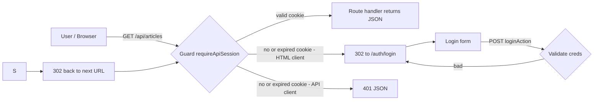
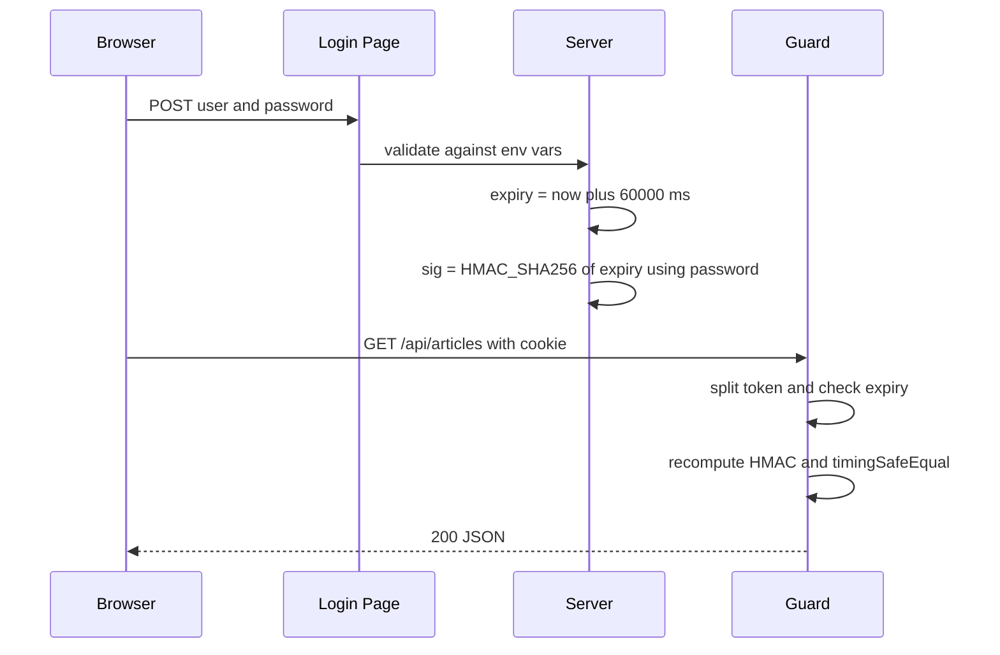
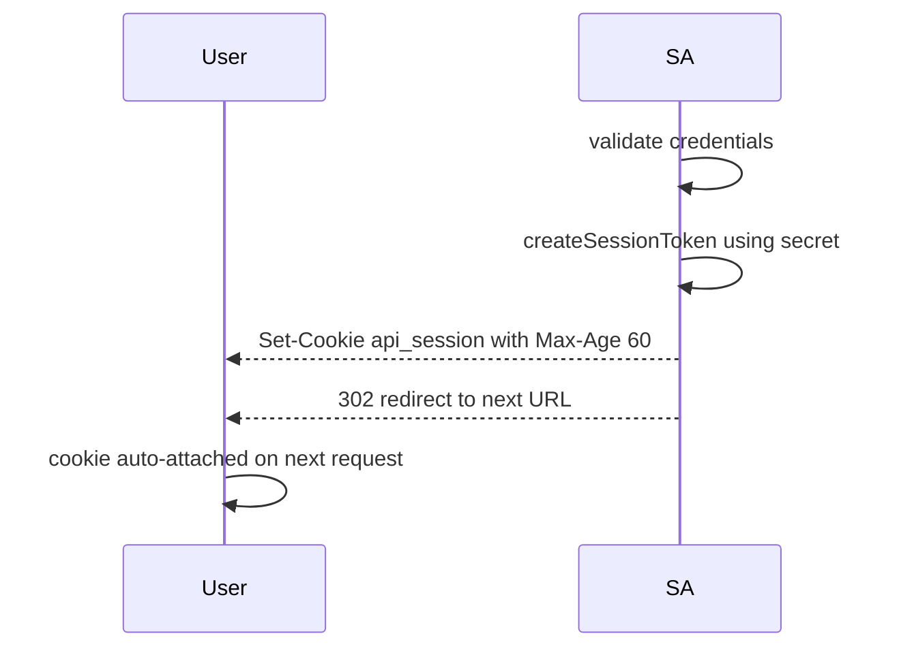
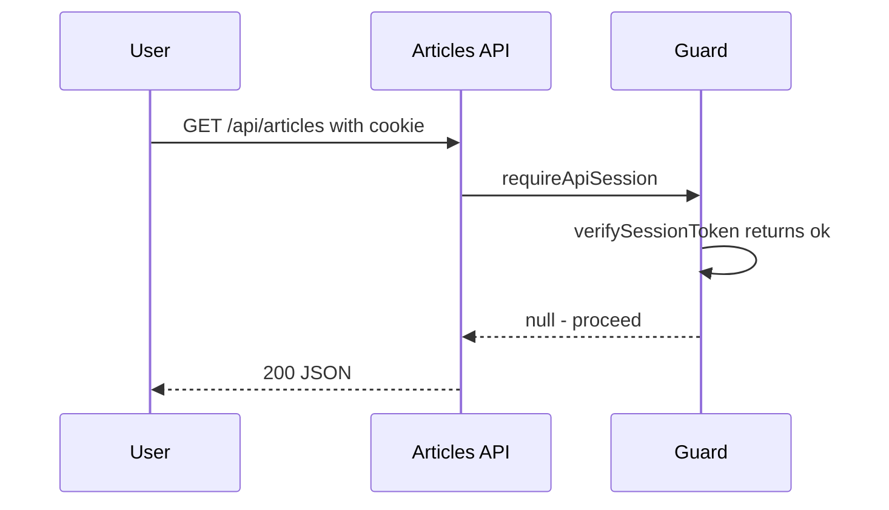
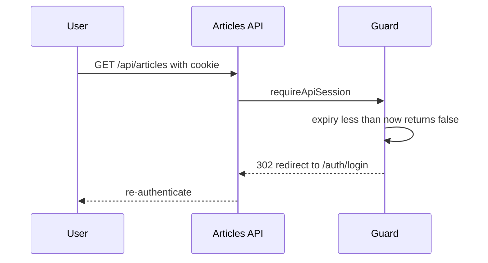

# API Authentication — Implementation Documentation

**Project:** Wipfli-style Next.js CMS
**Feature:** Short-lived signed-cookie session for protected API endpoints
**Status:** Shipped to production (`https://project-coral-eight.vercel.app`)
**Author:** Sharath K M

---

## 1. Overview

The public API endpoints that expose CMS data (`/api/articles`, `/api/optimizely/*`)
were originally accessible to anyone with the URL. This document describes the
authentication layer added on top of those endpoints.

Public marketing pages (`/en/*`, `/es/*`) remain completely open. Only data /
debug endpoints are protected.

### Why custom cookie session (not HTTP Basic Auth)

We first implemented HTTP Basic Auth (native browser popup), but browsers cache
the credentials for the entire process lifetime — once entered, every subsequent
request silently reuses them with no way to force a re-prompt. Demo and review
required visible, repeatable authentication, so we replaced Basic Auth with a
custom **60-second signed-cookie session**:

| Capability | Basic Auth | Cookie Session (chosen) |
|---|---|---|
| Native browser prompt | Yes | Custom login page (better UX) |
| Force re-prompt without quitting browser | No | Yes (60s TTL) |
| API-client friendly (curl/fetch) | Yes (header) | Yes (401 JSON for non-HTML) |
| Tamper-resistant token | N/A | HMAC-SHA256 signed |
| CSRF / cookie-theft hardening | N/A | HttpOnly, SameSite=Lax, Secure |

---

## 2. High-level architecture



---

## 3. Files added / modified

| File | Purpose | LOC |
|---|---|---|
| `src/lib/api-auth.ts` | Guard + token sign/verify + cookie reader | ~115 |
| `src/app/auth/login/page.tsx` | Login form + server action that issues the cookie | ~140 |
| `src/app/api/auth/logout/route.ts` | POST endpoint that clears the cookie | ~20 |
| 6 existing API route handlers | 2 lines each — call the guard before any work | +12 |
| `.env.example` | Document the two new env vars | +2 |

Folder layout:

```
src/
├── lib/
│   └── api-auth.ts                       ← auth core
└── app/
    ├── auth/
    └── api/
        ├── auth/logout/route.ts          ← POST logout
        ├── articles/route.ts             ← protected
        └── optimizely/
            ├── health/route.ts           ← protected
            ├── debug-articles/route.ts   ← protected
            ├── debug-page/route.ts       ← protected
            ├── debug-header/route.ts     ← protected
            └── debug-startpage/route.ts  ← protected
```


## 4. Environment variables

| Name | Required | Default | Purpose |
|---|---|---|---|
| `API_BASIC_AUTH_USER` | No | `admin` | Login username |
| `API_BASIC_AUTH_PASSWORD` | **Yes** | _(none)_ | Login password **and** HMAC secret. If unset, every protected route returns 503 (fail-closed). |

Set in:
- `.env.local` for local dev
- Vercel → Settings → Environment Variables (Production, Preview, Development)

Example:

```
API_BASIC_AUTH_USER=admin
API_BASIC_AUTH_PASSWORD=summit-api-2026
```

> After changing env vars on Vercel, redeploy for them to take effect.


## 5. The signed cookie

The cookie is **not** a plain password store — it's a signed token the server
can verify without any database.

**Format:**

```
<expiryMillis>.<hmacHex>
```

**Example:**

```
1717267800000.7f3c8b2e1a6d4e0c92...

**Why this works:**



Properties:

- **Tamper-proof** — changing the expiry invalidates the signature.
- **Stateless** — the server stores nothing; verification is pure crypto.
- **Self-expiring** — once `expiry < Date.now()`, no further verification needed.
- **Constant-time compare** — `crypto.timingSafeEqual` prevents timing attacks.
---

## 6. Request lifecycle
sequenceDiagram
    participant API as Articles API
    participant Guard
    U->>API: GET /api/articles with Accept text/html
    API->>Guard: requireApiSession
    Guard-->>API: 302 redirect to /auth/login
    API-->>U: 302 redirect
    U->>U: Login form rendered
```

### B. Successful login


### C. Subsequent request within 60 s



### D. Request after 60 s



---

## 7. Code walkthrough

### 7.1 `src/lib/api-auth.ts` — the guard

```ts
export function requireApiSession(request: Request): NextResponse | null {
  const secret = getExpectedPassword();
  if (!secret) {
    return NextResponse.json({ error: "Server auth not configured" }, { status: 503 });
  }

  const token = readCookie(request, SESSION_COOKIE);
  if (token && verifySessionToken(token, secret)) return null;   // ← request allowed

  const accept = request.headers.get("accept") ?? "";
  if (accept.includes("text/html")) {
    const reqUrl = new URL(request.url);
    const next = encodeURIComponent(reqUrl.pathname + reqUrl.search);
    return NextResponse.redirect(new URL(`/auth/login?next=${next}`, request.url), { status: 302 });
  }
  return NextResponse.json({ error: "Authentication required" }, { status: 401 });
}
```

### 7.2 Token sign / verify

```ts
export function createSessionToken(secret: string, ttlSeconds = 60): string {
  const expiry = Date.now() + ttlSeconds * 1000;
  const sig = createHmac("sha256", secret).update(String(expiry)).digest("hex");
  return `${expiry}.${sig}`;
}

export function verifySessionToken(token: string, secret: string): boolean {
  const [expiryStr, sig] = token.split(".");
  const expiry = Number(expiryStr);
  if (!Number.isFinite(expiry) || expiry < Date.now()) return false;       // expired
  const expected = createHmac("sha256", secret).update(expiryStr).digest("hex");
  return timingSafeEqual(Buffer.from(sig, "hex"), Buffer.from(expected, "hex"));
}
```

### 7.3 `src/app/auth/login/page.tsx` — the server action

```ts
async function loginAction(formData: FormData) {
  "use server";
  const user = String(formData.get("user") ?? "");
  const password = String(formData.get("password") ?? "");
  const next = String(formData.get("next") ?? "/api/articles");

  if (user !== getExpectedUser() || password !== getExpectedPassword()) {
    redirect(`/auth/login?error=invalid&next=${encodeURIComponent(next)}`);
  }

  const jar = await cookies();
  jar.set({
    name: SESSION_COOKIE,
    value: createSessionToken(getExpectedPassword()),
    httpOnly: true,
    sameSite: "lax",
    secure: process.env.NODE_ENV === "production",
    path: "/",
    maxAge: 60,
  });
  redirect(next);
}
```

### 7.4 Using the guard in any route (2 lines)

```ts
import { requireBasicAuth } from "@/lib/api-auth";   // alias of requireApiSession

export async function GET(request: Request) {
  const unauthorized = requireBasicAuth(request, "Articles API");
  if (unauthorized) return unauthorized;

  // ... real route logic ...
}
```

---

## 8. Step-by-step demo

> Open the URLs in an **InPrivate / Incognito window** so you start with no cookie.

| # | Action | Expected result |
|---|---|---|
| 1 | Open `https://project-coral-eight.vercel.app/api/articles` | Browser redirects to `/auth/login?next=/api/articles` |
| 2 | Enter `admin` / `<password>` → **Sign in** | Server signs cookie, redirects back, JSON response appears |
| 3 | DevTools → Application → Cookies → `api_session` | Value is `<expiry>.<hmacHex>` — HttpOnly, Secure |
| 4 | Reload within 60s | JSON shown silently — no prompt |
| 5 | Wait > 60s, reload | Redirected to login page again |
| 6 | (Optional) `curl https://project-coral-eight.vercel.app/api/articles` | Returns `{"error":"Authentication required"}` 401 (no redirect) |
| 7 | (Optional) Force logout: `curl -X POST https://project-coral-eight.vercel.app/api/auth/logout` | Cookie cleared immediately |

---

## 9. Security properties

| Concern | Mitigation |
|---|---|
| Cookie theft via XSS | `HttpOnly` — JavaScript cannot read the cookie |
| MITM over HTTP | `Secure` in production — cookie only sent over HTTPS |
| CSRF (cross-site form post) | `SameSite=Lax` — cookie not sent on cross-site POSTs |
| Token forgery | HMAC-SHA256 signed with `API_BASIC_AUTH_PASSWORD` |
| Expiry tampering | Expiry is part of the HMAC input — any change invalidates the signature |
| Timing attack on signature compare | `crypto.timingSafeEqual` |
| Brute-force password | Server-side only check; rate-limit can be added at edge if needed |
| Forgotten env var | Fails closed — protected routes return 503, never leak data |
| Long-lived sessions | 60-second TTL (configurable single constant) |

---

## 10. Operational runbook

### Set / rotate credentials

1. Update `API_BASIC_AUTH_PASSWORD` in **Vercel → Settings → Environment Variables**
   (Production, Preview, Development).
2. Redeploy (`Deployments → ⋯ → Redeploy`).
3. **Important:** rotating the password invalidates **all** existing cookies
   immediately (their HMAC no longer verifies). Users must log in again.

### Change session TTL

In `src/lib/api-auth.ts`:

```ts
export const SESSION_TTL_SECONDS = 60;   // ← change here
```

Suggested values:

| Use case | Value |
|---|---|
| Demo | 60 s |
| Internal team use | 900 s (15 min) |
| Long admin session | 3600 s (1 hr) |

### Add a new protected endpoint

```ts
import { requireBasicAuth } from "@/lib/api-auth";

export async function GET(request: Request) {
  const unauthorized = requireBasicAuth(request, "My New Endpoint");
  if (unauthorized) return unauthorized;
  // ...
}
```

That's it — no middleware registration needed.

---

## 11. Troubleshooting

| Symptom | Cause | Fix |
|---|---|---|
| `{"error":"Server auth not configured"}` 503 | `API_BASIC_AUTH_PASSWORD` not set | Add env var on Vercel + redeploy |
| Browser keeps redirecting to login even with correct password | Cookie blocked (third-party / privacy mode that drops cookies) | Use a normal window or whitelist the domain |
| `curl` returns HTML instead of JSON | `Accept: text/html` header was sent | Add `-H "Accept: application/json"` |
| Login form says "Invalid username or password" | Case mismatch, trailing whitespace, or different password on Vercel vs local | Verify env var values |
| Cookie not set after login | Running over HTTP in production (Secure flag blocks it) | Always use HTTPS in production |

---

## 12. Future enhancements (not in scope today)

- Sign-out button on protected JSON pages
- Multiple user accounts with per-user audit logging
- Rate limiting on `/auth/login` (e.g. via Vercel Edge Middleware)
- Sliding session renewal (extend TTL on activity)
- OAuth / SSO integration (Azure AD, Okta) for internal use

---

## 13. Commits

| Commit | Description |
|---|---|
| `395349d` | feat: HTTP Basic Auth on `/api/articles` and `/api/optimizely/*` data endpoints |
| `77a163a` | feat(auth): replace Basic Auth with 60s signed-cookie session + login page |

---

## 14. Summary

- **4 files, ~150 lines, zero new dependencies.**
- Browsers get a polished login page; API clients get clean 401 JSON.
- 60-second signed-cookie session — short, demoable, secure by default.
- Fails closed on misconfiguration — no silent exposure.
- Adding a new protected route is a 2-line change.
