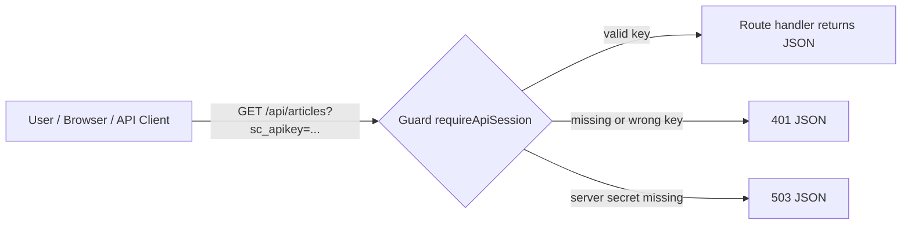

# API Authentication — Implementation Documentation

**Project:** Wipfli-style Next.js CMS
**Feature:** Shared query-parameter protection for protected API endpoints
**Status:** Shipped to production (`https://project-coral-eight.vercel.app`)
**Author:** Sharath K M

---

## 1. Overview

The data and debug endpoints (`/api/articles`, `/api/optimizely/*`) are protected
with a shared secret passed directly in the request URL.

Public marketing pages (`/en/*`, `/es/*`) remain completely open. Only data and
debug endpoints are protected.

### Why query-parameter auth

The earlier cookie/session flow added state, login UI, and a short-lived
re-authentication cycle just to inspect read-only API responses. For mentor
review and demo links, the simpler requirement was a single URL that can be
opened directly in a browser.

Chosen pattern:

```text
/api/articles?sc_apikey=<shared-secret>
```

This keeps the protection lightweight while staying easy to test in a browser,
curl, Postman, or shared documentation.

---

## 2. High-level architecture



---

## 3. Files added / modified

| File | Purpose |
|---|---|
| `src/lib/api-auth.ts` | Shared guard that validates `?sc_apikey=` against the configured secret |
| `src/app/auth/login/page.tsx` | Informational page explaining the new URL-based access pattern |
| `src/app/api/auth/logout/route.ts` | Legacy endpoint retained as a plain redirect; no cookie clearing remains |
| 6 existing API route handlers | Continue calling the shared guard before any work |

Protected routes:

```text
src/app/api/articles/route.ts
src/app/api/optimizely/health/route.ts
src/app/api/optimizely/debug-articles/route.ts
src/app/api/optimizely/debug-page/route.ts
src/app/api/optimizely/debug-header/route.ts
src/app/api/optimizely/debug-startpage/route.ts
```

---

## 4. Environment variables

| Name | Required | Purpose |
|---|---|---|
| `API_ACCESS_KEY` | Preferred | Shared secret expected in `?sc_apikey=` |
| `API_BASIC_AUTH_PASSWORD` | Fallback only | Back-compat fallback if `API_ACCESS_KEY` is unset |

Example:

```text
API_ACCESS_KEY=summit-api-2026
```

If both are present, `API_ACCESS_KEY` wins.

---

## 5. Guard behavior

The shared helper reads the query parameter named `sc_apikey` and compares it to the
configured secret using `crypto.timingSafeEqual`.

Request outcomes:

| Condition | HTTP | Body |
|---|---|---|
| Valid `?sc_apikey=` | 200 | Route-specific JSON payload |
| Missing or wrong `?sc_apikey=` | 401 | `{ error: "Authentication required", queryParam: "sc_apikey", hint: ... }` |
| No server secret configured | 503 | `{ error: "Server auth not configured", queryParam: "sc_apikey" }` |

---

## 6. Usage examples

```text
https://project-coral-eight.vercel.app/api/articles?sc_apikey=YOUR_SECRET
https://project-coral-eight.vercel.app/api/articles?limit=5&sc_apikey=YOUR_SECRET
https://project-coral-eight.vercel.app/api/optimizely/health?sc_apikey=YOUR_SECRET
https://project-coral-eight.vercel.app/api/optimizely/debug-page?slug=Login&sc_apikey=YOUR_SECRET
```

If a route already has query parameters, append the secret with `&sc_apikey=...`.

---

## 7. Security notes

- This is intentionally simpler than cookie or header-based auth.
- URLs can appear in browser history, logs, analytics, and shared screenshots.
- Use a strong random secret and rotate it if the link has been shared too widely.
- This is appropriate for internal review/demo access, not for high-sensitivity APIs.

---

## 8. Rotation

1. Update `API_ACCESS_KEY` in local and hosted environment variables.
2. Redeploy if required by the hosting environment.
3. Replace shared URLs so they include the new `?sc_apikey=` value.

No server-side session invalidation step is needed because the system is
stateless.

---

## 9. Summary

- Protected API endpoints now use a shared URL secret.
- Cookie/session-based API login is no longer required.
- The implementation is stateless and easy to test in a browser.
- The query parameter name now matches the `sc_apikey` pattern used by the original system.
- Missing configuration still fails closed.
}
```

### 7.2 Token sign / verify

```ts
export function createSessionToken(secret: string, ttlSeconds = 60): string {
  const expiry = Date.now() + ttlSeconds * 1000;
  const sig = createHmac("sha256", secret).update(String(expiry)).digest("hex");
  return `${expiry}.${sig}`;
}

export function verifySessionToken(token: string, secret: string): boolean {
  const [expiryStr, sig] = token.split(".");
  const expiry = Number(expiryStr);
  if (!Number.isFinite(expiry) || expiry < Date.now()) return false;       // expired
  const expected = createHmac("sha256", secret).update(expiryStr).digest("hex");
  return timingSafeEqual(Buffer.from(sig, "hex"), Buffer.from(expected, "hex"));
}
```

### 7.3 `src/app/auth/login/page.tsx` — the server action

```ts
async function loginAction(formData: FormData) {
  "use server";
  const user = String(formData.get("user") ?? "");
  const password = String(formData.get("password") ?? "");
  const next = String(formData.get("next") ?? "/api/articles");

  if (user !== getExpectedUser() || password !== getExpectedPassword()) {
    redirect(`/auth/login?error=invalid&next=${encodeURIComponent(next)}`);
  }

  const jar = await cookies();
  jar.set({
    name: SESSION_COOKIE,
    value: createSessionToken(getExpectedPassword()),
    httpOnly: true,
    sameSite: "lax",
    secure: process.env.NODE_ENV === "production",
    path: "/",
    maxAge: 60,
  });
  redirect(next);
}
```

### 7.4 Using the guard in any route (2 lines)

```ts
import { requireBasicAuth } from "@/lib/api-auth";   // alias of requireApiSession

export async function GET(request: Request) {
  const unauthorized = requireBasicAuth(request, "Articles API");
  if (unauthorized) return unauthorized;

  // ... real route logic ...
}
```

---

## 8. Step-by-step demo

> Open the URLs in an **InPrivate / Incognito window** so you start with no cookie.

| # | Action | Expected result |
|---|---|---|
| 1 | Open `https://project-coral-eight.vercel.app/api/articles` | Browser redirects to `/auth/login?next=/api/articles` |
| 2 | Enter `admin` / `<password>` → **Sign in** | Server signs cookie, redirects back, JSON response appears |
| 3 | DevTools → Application → Cookies → `api_session` | Value is `<expiry>.<hmacHex>` — HttpOnly, Secure |
| 4 | Reload within 60s | JSON shown silently — no prompt |
| 5 | Wait > 60s, reload | Redirected to login page again |
| 6 | (Optional) `curl https://project-coral-eight.vercel.app/api/articles` | Returns `{"error":"Authentication required"}` 401 (no redirect) |
| 7 | (Optional) Force logout: `curl -X POST https://project-coral-eight.vercel.app/api/auth/logout` | Cookie cleared immediately |

---

## 9. Security properties

| Concern | Mitigation |
|---|---|
| Cookie theft via XSS | `HttpOnly` — JavaScript cannot read the cookie |
| MITM over HTTP | `Secure` in production — cookie only sent over HTTPS |
| CSRF (cross-site form post) | `SameSite=Lax` — cookie not sent on cross-site POSTs |
| Token forgery | HMAC-SHA256 signed with `API_BASIC_AUTH_PASSWORD` |
| Expiry tampering | Expiry is part of the HMAC input — any change invalidates the signature |
| Timing attack on signature compare | `crypto.timingSafeEqual` |
| Brute-force password | Server-side only check; rate-limit can be added at edge if needed |
| Forgotten env var | Fails closed — protected routes return 503, never leak data |
| Long-lived sessions | 60-second TTL (configurable single constant) |

---

## 10. Operational runbook

### Set / rotate credentials

1. Update `API_BASIC_AUTH_PASSWORD` in **Vercel → Settings → Environment Variables**
   (Production, Preview, Development).
2. Redeploy (`Deployments → ⋯ → Redeploy`).
3. **Important:** rotating the password invalidates **all** existing cookies
   immediately (their HMAC no longer verifies). Users must log in again.

### Change session TTL

In `src/lib/api-auth.ts`:

```ts
export const SESSION_TTL_SECONDS = 60;   // ← change here
```

Suggested values:

| Use case | Value |
|---|---|
| Demo | 60 s |
| Internal team use | 900 s (15 min) |
| Long admin session | 3600 s (1 hr) |

### Add a new protected endpoint

```ts
import { requireBasicAuth } from "@/lib/api-auth";

export async function GET(request: Request) {
  const unauthorized = requireBasicAuth(request, "My New Endpoint");
  if (unauthorized) return unauthorized;
  // ...
}
```

That's it — no middleware registration needed.

---

## 11. Troubleshooting

| Symptom | Cause | Fix |
|---|---|---|
| `{"error":"Server auth not configured"}` 503 | `API_BASIC_AUTH_PASSWORD` not set | Add env var on Vercel + redeploy |
| Browser keeps redirecting to login even with correct password | Cookie blocked (third-party / privacy mode that drops cookies) | Use a normal window or whitelist the domain |
| `curl` returns HTML instead of JSON | `Accept: text/html` header was sent | Add `-H "Accept: application/json"` |
| Login form says "Invalid username or password" | Case mismatch, trailing whitespace, or different password on Vercel vs local | Verify env var values |
| Cookie not set after login | Running over HTTP in production (Secure flag blocks it) | Always use HTTPS in production |

---

## 12. Future enhancements (not in scope today)

- Sign-out button on protected JSON pages
- Multiple user accounts with per-user audit logging
- Rate limiting on `/auth/login` (e.g. via Vercel Edge Middleware)
- Sliding session renewal (extend TTL on activity)
- OAuth / SSO integration (Azure AD, Okta) for internal use

---

## 13. Commits

| Commit | Description |
|---|---|
| `395349d` | feat: HTTP Basic Auth on `/api/articles` and `/api/optimizely/*` data endpoints |
| `77a163a` | feat(auth): replace Basic Auth with 60s signed-cookie session + login page |

---

## 14. Summary

- **4 files, ~150 lines, zero new dependencies.**
- Browsers get a polished login page; API clients get clean 401 JSON.
- 60-second signed-cookie session — short, demoable, secure by default.
- Fails closed on misconfiguration — no silent exposure.
- Adding a new protected route is a 2-line change.
