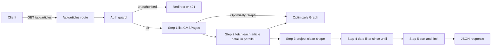
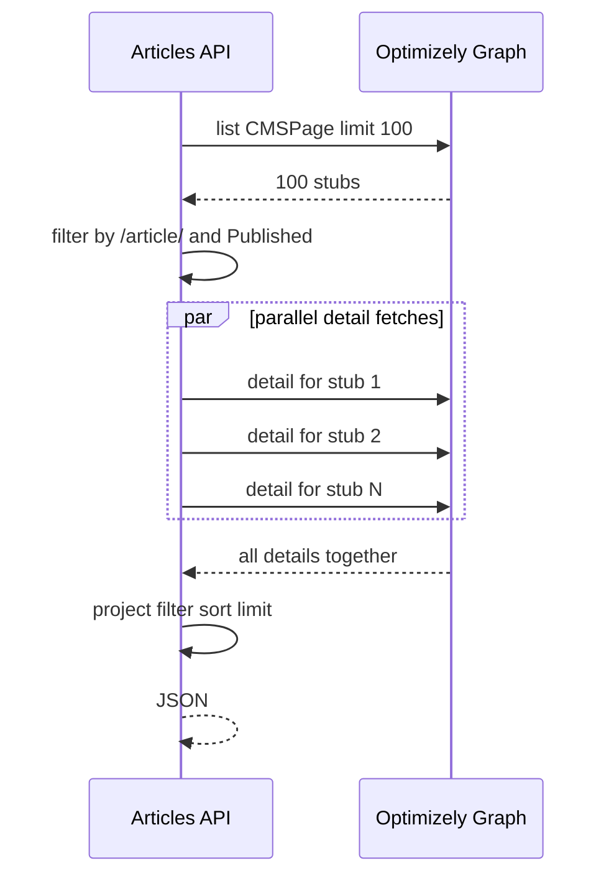
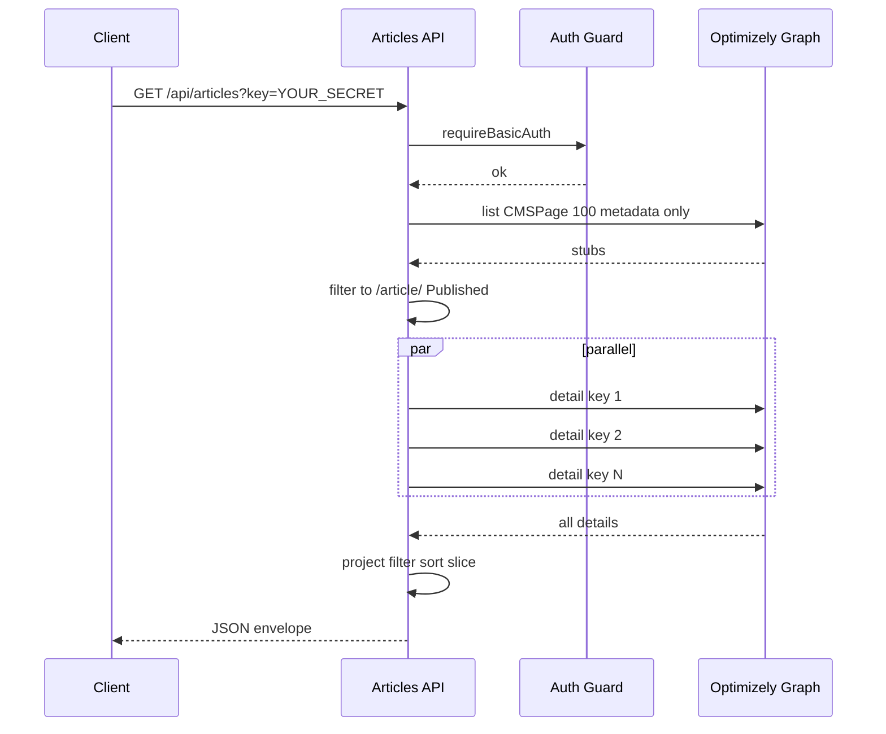
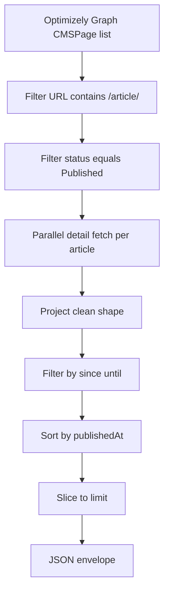

# Articles API — Latest Published Articles from Optimizely Graph

**Project:** Wipfli-style Next.js CMS
**Endpoint:** `GET /api/articles`
**File:** `src/app/api/articles/route.ts`
**Status:** Shipped and verified in production
**Commits:** `345d7eb` (initial), `77a163a` (auth), `75dd2de` (locale safelist + date fallback)
**Author:** Sharath K M

---

## 1. Problem statement

The team needed a single JSON endpoint that returns the **latest published
articles** from Optimizely so other systems (mobile app, partner integrations,
internal dashboards) can consume them without scraping HTML.

Requirements:

- Return only **Published** articles (not drafts, not work-in-progress)
- Project a clean, stable shape — header, description, image, topics, etc.
- Support filtering by `locale`, `since`, `until`
- Support `order=asc/desc` and `limit` (1–100)
- Always sorted by published date (most-recent first by default)
- Locked behind authentication (see `docs/API_AUTHENTICATION.md`)
- Gracefully handle unsupported locales without crashing Optimizely Graph
- Every article must have a usable date for sorting/filtering

---

## 2. Query parameters

| Param | Type | Default | Notes |
|---|---|---|---|
| `locale` | `en` or `es` | `en` | Any other value silently falls back to `en`; see `localeFellBack` in response |
| `limit` | int | `20` | Capped at `100` |
| `order` | `asc` or `desc` | `desc` | Sort direction by published date |
| `since` | ISO date | _(none)_ | Inclusive lower bound — articles on or after this date |
| `until` | ISO date | _(none)_ | Inclusive upper bound — articles on or before this date |

Examples:

```
GET /api/articles
GET /api/articles?limit=5
GET /api/articles?locale=en&limit=10&order=asc
GET /api/articles?since=2026-05-01&until=2026-05-31
GET /api/articles?locale=es&limit=5
GET /api/articles?locale=fr   ← unsupported, falls back to en with localeFellBack:true
```

---

## 3. Response shape

```json
{
  "count": 3,
  "total": 19,
  "locale": "en",
  "requestedLocale": null,
  "localeFellBack": false,
  "order": "desc",
  "limit": 3,
  "filter": { "since": null, "until": null },
  "supportedLocales": ["en", "es"],
  "generatedAt": "2026-06-03T04:21:06.995Z",
  "items": [
    {
      "id": "89084a7cc1b7426eb00e9f18636c68ad",
      "locale": "en",
      "status": "Published",
      "header": "title for article 18",
      "description": "descr of article",
      "url": "/en/article/article-page-18/",
      "imageUrl": "https://images.unsplash.com/photo-1506905925346-21bda4d32df4",
      "imageAlt": null,
      "publishedAt": "2026-05-27T06:23:57.375Z",
      "readTime": null,
      "authorId": null,
      "topics": ["tax", "audit"],
      "industries": [],
      "services": []
    }
  ]
}
```

### New response fields (added in commit `75dd2de`)

| Field | Purpose |
|---|---|
| `requestedLocale` | The raw `?locale=` value the client sent (or `null` if omitted) |
| `localeFellBack` | `true` if the requested locale was not supported and the API fell back to `en` |
| `supportedLocales` | Array of locales the API accepts — currently `["en", "es"]` |

- `count` — number of items returned (after filtering + limit)
- `total` — number of items matched by filters (before limit)
- `filter` — echoed back as parsed ISO strings, so the caller can confirm
- `generatedAt` — server timestamp for cache-busting on the client

---

## 4. High-level architecture



---

## 5. Step-by-step implementation

### Step 0 — Auth guard (added later)

```ts
import { requireBasicAuth } from "@/lib/api-auth";

export async function GET(request: Request) {
  const unauthorized = requireBasicAuth(request, "Articles API");
  if (unauthorized) return unauthorized;
  ...
}
```

This 2-line block sits at the top of the handler and short-circuits the
request if there is no valid `?key=` query parameter.

### Step 1 — Validate config, parse inputs + locale safelist

```ts
const SUPPORTED_LOCALES = ["en", "es"] as const;

function parseLocale(raw: string | null | undefined): SupportedLocale {
  const v = (raw ?? "").trim().toLowerCase();
  return SUPPORTED_LOCALES.includes(v) ? v : "en";
}

// inside GET:
const localeParam = url.searchParams.get("locale");
const locale = parseLocale(localeParam);
const localeFellBack = !!localeParam && locale !== localeParam.trim().toLowerCase();
```

- `limit` clamped 1–100
- `order` only accepts `asc`/`desc` (anything else → `desc`)
- `locale` checked against the safelist — unknown values silently fall back to `en`
- `since`/`until` parsed to milliseconds; bad input silently ignored
- Fails closed (503) if Optimizely env vars are missing

### Step 2 — Cheap listing call (metadata only)

We don't know up front which CMSPages are articles, so we list them with
metadata only — keeping the first query small.

```ts
const listQuery = `query {
  CMSPage(limit: 100, locale: ${locale}) {
    items {
      _metadata { key locale displayName status url { default hierarchical } }
    }
  }
}`;
```

Articles are identified by URL convention: any page whose URL contains
`/article/` is treated as an article (except the index page `/article/all`).

```ts
const articleStubs = listItems.filter((it) => {
  const path = it._metadata?.url?.default ?? it._metadata?.url?.hierarchical ?? "";
  const isArticleUrl = /\/article\//i.test(path) && !/\/article\/all\b/i.test(path);
  if (!isArticleUrl) return false;
  const status = (it._metadata?.status ?? "").toLowerCase();
  if (status && status !== "published") return false;
  return true;
});
```

### Step 3 — Parallel detail fetch

For each article stub, fetch the full detail (title, description, _json blob,
keywords) **in parallel**.

```ts
const detailed = await Promise.all(
  articleStubs.map(async (stub) => {
    const detailQuery = `query {
      CMSPage(locale: ${locale}, ids: ["${stub._metadata.key}"]) {
        item {
          title
          shortDescription
          keywords
          _json
          _metadata { key locale displayName status url { default hierarchical } }
        }
      }
    }`;
    ...
    return p?.data?.CMSPage?.item ?? null;
  }),
);
```

`Promise.all` keeps the latency at "one Graph round-trip" regardless of how
many articles we are fetching.



### Step 4 — Project a stable shape — date fallback chain

The original implementation only looked at `_json.publishedAt` and aliases.
If the article author never set that field, the date was `null` and
`?since`/`?until` filters silently dropped the article.

**Fix (commit `75dd2de`):** Added `_metadata.published`, `_metadata.lastModified`,
and `_metadata.created` as additional fallbacks. Optimizely Graph always
populates these — so every article now has a date and no article is invisible
to filters.

```ts
const publishedAtRaw =
  // article-level fields set by the content author
  readString(j.publishedAt) ??
  readString(j.PublishedAt) ??
  readString(j.publishDate) ??
  readString(j.PublishDate) ??
  readString(j.startPublish) ??
  // Optimizely Graph metadata — always present
  readString(m.published) ??
  readString(m.lastModified) ??
  readString(m.created);
```

Priority: explicit article date first → Graph publish timestamp → last modified → created.

The `_metadata` object also now requests `published`, `created`, and
`lastModified` in both the list and detail Graph queries so these fields are
always available.

### Step 6 — Sort and limit

```ts
const sorted = [...dateFiltered].sort((a, b) => {
  const aMs = a.publishedAtMs, bMs = b.publishedAtMs;
  if (aMs === null && bMs === null) return 0;
  if (aMs === null) return 1;       // undated sinks to the end
  if (bMs === null) return -1;
  return order === "asc" ? aMs - bMs : bMs - aMs;
});

const items = sorted.slice(0, limit).map(({ publishedAtMs: _ms, ...rest }) => rest);
```

`publishedAtMs` is an internal field used only for sorting; it is stripped
before sending to the client.

### Step 7 — Return the envelope

```ts
return NextResponse.json({
  count: items.length,
  total: dateFiltered.length,
  locale, order, limit,
  filter: {
    since: sinceMs !== null ? new Date(sinceMs).toISOString() : null,
    until: untilMs !== null ? new Date(untilMs).toISOString() : null,
  },
  generatedAt: new Date().toISOString(),
  items,
});
```

---

## 6. Request lifecycle



---

## 7. Data pipeline summary



---

## 8. Verified demo URLs

All verified in production on 2026-06-03. Log in first via
`https://project-coral-eight.vercel.app/api/articles` → enter credentials.

| URL | Verified result |
|---|---|
| `/api/articles` | 19 articles, newest first |
| `/api/articles?limit=3` | 3 items, `total: 19` |
| `/api/articles?order=asc` | Oldest article first (May 18 2026) |
| `/api/articles?since=2025-01-01` | All 19 (all published after Jan 2025) |
| `/api/articles?since=2026-05-01&until=2026-05-31` | Articles from May 2026 |
| `/api/articles?locale=es` | Spanish translations (after Optimizely step) |
| `/api/articles?locale=fr` | English items + `localeFellBack: true` — graceful |
| `/api/articles?locale=es&limit=2` | 2 Spanish articles |

---

## 9. Why this design

| Design choice | Reason |
|---|---|
| Two-phase fetch (list then detail) | List query is cheap; we only pay for details on real articles |
| `Promise.all` for details | Latency stays O(1) network round-trips |
| Multiple `publishedAt` field aliases | Optimizely versions/templates name the field differently |
| `_metadata.published` as final fallback | Always present; ensures no article is ever dateless |
| Locale safelist (`en`, `es` only) | Prevents Graph 400 errors; unknown locales fall back gracefully |
| `localeFellBack` + `requestedLocale` in response | Caller knows exactly what happened without reading logs |
| URL convention `/article/` | No dedicated content type in this project — URL is the source of truth |
| Internal `publishedAtMs` field | Avoids re-parsing dates during sort; stripped from response |
| Envelope (`count`, `total`, `filter`, `generatedAt`) | Self-describing payload, easy to debug client-side |
| 503 if env missing | Fail closed, never serve empty results from a misconfigured deploy |

---

## 10. Error handling

| Condition | HTTP | Body |
|---|---|---|
| Unauthenticated | 302 redirect (browser) / 401 JSON (API client) | handled by guard |
| `OPTIMIZELY_RENDER_URL` / `_KEY` missing | 503 | `{ error: "Optimizely not configured" }` |
| Optimizely Graph returned non-2xx on list | 502 | `{ error: "Optimizely Graph request failed", status }` |
| Bad `since` / `until` strings | 200 | filter silently ignored (`Date.parse` returned `NaN`) |
| No articles match filters | 200 | `items: []`, `count: 0`, `total: 0` |

---

## 11. Performance

- **Network**: 1 list query + N parallel detail queries (currently N ≤ 100)
- **Server CPU**: O(N log N) for the sort, O(N) for everything else
- **Caching**: `dynamic = "force-dynamic"` — every request is fresh because the
  webhook handler invalidates Next.js caches on publish (see
  `docs/WEBHOOK_PUBLISHED_FILTERING.md`)
- **Auth overhead**: ~1 ms (HMAC verify)

For higher article counts a future enhancement is to switch to a single Graph
query that returns full details for items where the URL matches a server-side
pattern.

---

## 12. Configuration

| Env var | Required | Purpose |
|---|---|---|
| `OPTIMIZELY_RENDER_URL` | yes | Optimizely Graph endpoint base |
| `OPTIMIZELY_RENDER_KEY` | yes | Public render key (delivery-only) |
| `API_ACCESS_KEY` | preferred | Shared URL secret for protected endpoints |
| `API_BASIC_AUTH_PASSWORD` | fallback | Back-compat fallback when `API_ACCESS_KEY` is unset |

---

## 13. Future enhancements (not in scope)

- Server-side URL pattern matching in the Graph query → single round-trip
- Cursor-based pagination (`?cursor=`) for >100 items
- Per-tag filtering (`?topic=Cybersecurity`)
- ETag / Last-Modified support for client caching
- OpenAPI / typed client generation

---

## 14. Summary

- One endpoint, one envelope, predictable shape
- Optimizely Graph integration normalised across field-name variants
- **Locale safelist** — only `en`/`es` accepted; unsupported locales fall back to `en` gracefully
- **Date fallback chain** — every article gets a date (`_metadata.published` as final fallback)
- Date filtering via inclusive `since`/`until` ISO bounds — **verified working in production**
- Always sorted by published date, default newest-first
- Query-parameter gated (`?key=`); misconfiguration fails closed
- Cache invalidation handled by the publish-only webhook filter
- Response includes `requestedLocale`, `localeFellBack`, `supportedLocales` for client transparency
