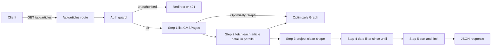
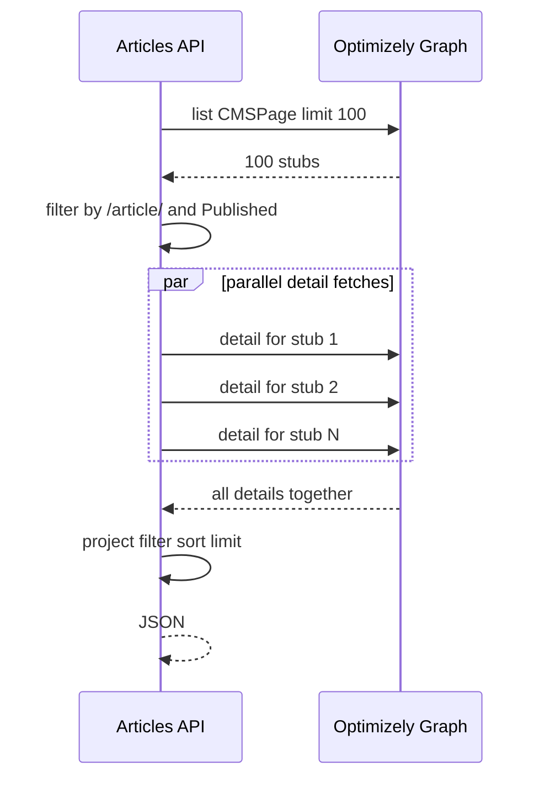
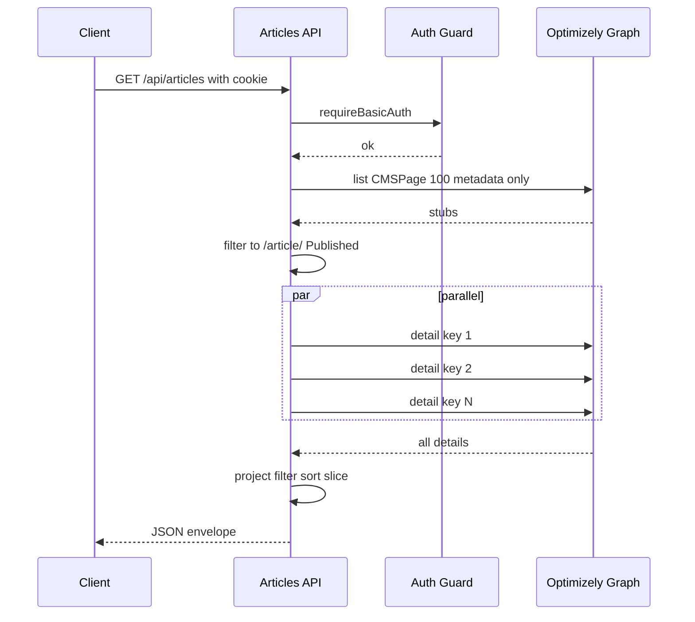
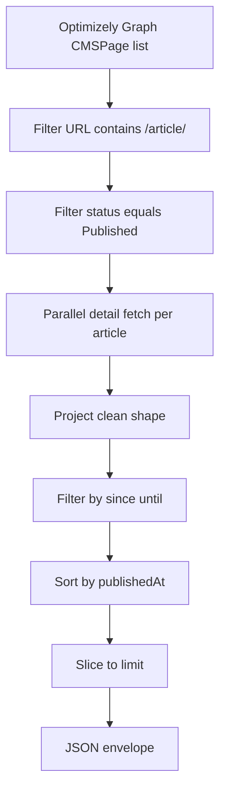

# Articles API — Latest Published Articles from Optimizely Graph

**Project:** Wipfli-style Next.js CMS
**Endpoint:** `GET /api/articles`
**File:** `src/app/api/articles/route.ts`
**Status:** Shipped (commit `345d7eb`), protected by cookie session (commit `77a163a`)
**Author:** Sharath K M

---

## 1. Problem statement

The team needed a single JSON endpoint that returns the **latest published
articles** from Optimizely so other systems (mobile app, partner integrations,
internal dashboards) can consume them without scraping HTML.

Requirements:

- Return only **Published** articles (not drafts, not work-in-progress)
- Project a clean, stable shape — header, description, image, topics, etc.
- Support filtering by `locale`, `since`, `until`
- Support `order=asc/desc` and `limit` (1–100)
- Always sorted by published date (most-recent first by default)
- Locked behind authentication (handled by the cookie session — see
  `docs/API_AUTHENTICATION.md`)

---

## 2. Query parameters

| Param | Type | Default | Notes |
|---|---|---|---|
| `locale` | string | `en` | Passed straight to Optimizely Graph |
| `limit` | int | `20` | Capped at `100` |
| `order` | `asc` \| `desc` | `desc` | Sort by published date |
| `since` | ISO date | _(none)_ | Inclusive lower bound on `publishedAt` |
| `until` | ISO date | _(none)_ | Inclusive upper bound on `publishedAt` |

Examples:

```
GET /api/articles
GET /api/articles?limit=5
GET /api/articles?locale=en&limit=10&order=asc
GET /api/articles?since=2025-01-01&until=2025-12-31
```

---

## 3. Response shape

```json
{
  "count": 5,
  "total": 12,
  "locale": "en",
  "order": "desc",
  "limit": 5,
  "filter": { "since": null, "until": null },
  "generatedAt": "2026-06-01T09:21:15.715Z",
  "items": [
    {
      "id": "abc-123",
      "locale": "en",
      "status": "Published",
      "header": "Why our cybersecurity audit changed our cloud strategy",
      "description": "A short summary of the article ...",
      "url": "/article/cybersecurity-audit-cloud",
      "imageUrl": "https://.../card.jpg",
      "imageAlt": "Server room",
      "publishedAt": "2025-11-04T08:30:00Z",
      "readTime": "6 min",
      "authorId": "author-42",
      "topics": ["Cybersecurity", "Cloud"],
      "industries": ["Manufacturing"],
      "services": ["Risk Advisory"]
    }
  ]
}
```

- `count` — number of items returned (after filtering + limit)
- `total` — number of items matched by filters (before limit)
- `filter` — echoed back as parsed ISO strings, so the caller can confirm
- `generatedAt` — server timestamp for cache-busting on the client

---

## 4. High-level architecture



---

## 5. Step-by-step implementation

### Step 0 — Auth guard (added later)

```ts
import { requireBasicAuth } from "@/lib/api-auth";

export async function GET(request: Request) {
  const unauthorized = requireBasicAuth(request, "Articles API");
  if (unauthorized) return unauthorized;
  ...
}
```

This 2-line block sits at the top of the handler and short-circuits the
request if there is no valid session cookie.

### Step 1 — Validate config, parse inputs

```ts
const renderUrl = process.env.OPTIMIZELY_RENDER_URL?.trim();
const renderKey = process.env.OPTIMIZELY_RENDER_KEY?.trim();

if (!renderUrl || !renderKey) {
  return NextResponse.json({ error: "Optimizely not configured" }, { status: 503 });
}

const url = new URL(request.url);
const limit = Math.min(parseInt(url.searchParams.get("limit") ?? "20", 10) || 20, 100);
const order = (url.searchParams.get("order") ?? "desc").toLowerCase() === "asc" ? "asc" : "desc";
const locale = url.searchParams.get("locale")?.trim() || "en";
const sinceMs = parseDate(url.searchParams.get("since"));
const untilMs = parseDate(url.searchParams.get("until"));
```

- `limit` is clamped between 1 and 100
- `order` only accepts `asc` or `desc` (anything else → `desc`)
- `since` / `until` are parsed to millis and validated; bad input is silently ignored
- Fails closed (503) if Optimizely env vars are missing

### Step 2 — Cheap listing call (metadata only)

We don't know up front which CMSPages are articles, so we list them with
metadata only — keeping the first query small.

```ts
const listQuery = `query {
  CMSPage(limit: 100, locale: ${locale}) {
    items {
      _metadata { key locale displayName status url { default hierarchical } }
    }
  }
}`;
```

Articles are identified by URL convention: any page whose URL contains
`/article/` is treated as an article (except the index page `/article/all`).

```ts
const articleStubs = listItems.filter((it) => {
  const path = it._metadata?.url?.default ?? it._metadata?.url?.hierarchical ?? "";
  const isArticleUrl = /\/article\//i.test(path) && !/\/article\/all\b/i.test(path);
  if (!isArticleUrl) return false;
  const status = (it._metadata?.status ?? "").toLowerCase();
  if (status && status !== "published") return false;
  return true;
});
```

### Step 3 — Parallel detail fetch

For each article stub, fetch the full detail (title, description, _json blob,
keywords) **in parallel**.

```ts
const detailed = await Promise.all(
  articleStubs.map(async (stub) => {
    const detailQuery = `query {
      CMSPage(locale: ${locale}, ids: ["${stub._metadata.key}"]) {
        item {
          title
          shortDescription
          keywords
          _json
          _metadata { key locale displayName status url { default hierarchical } }
        }
      }
    }`;
    ...
    return p?.data?.CMSPage?.item ?? null;
  }),
);
```

`Promise.all` keeps the latency at "one Graph round-trip" regardless of how
many articles we are fetching.



### Step 4 — Project a stable shape

The CMS exposes a sprawling `_json` blob. We project only the fields we want
to expose, normalising casing and falling back through multiple field names
Optimizely uses inconsistently (`publishedAt`, `PublishedAt`, `publishDate`,
`PublishDate`, `startPublish`).

```ts
.map((it) => {
  const j = it._json ?? {};
  const path = it._metadata?.url?.default ?? "";
  const publishedAtRaw =
    readString(j.publishedAt) ??
    readString(j.PublishedAt) ??
    readString(j.publishDate) ??
    readString(j.PublishDate) ??
    readString(j.startPublish);
  const publishedAtMs = parseDate(publishedAtRaw);

  return {
    id: it._metadata?.key ?? null,
    locale: it._metadata?.locale ?? locale,
    status: it._metadata?.status ?? "Published",
    header: readString(it.title) ?? readString(j.title) ?? it._metadata?.displayName ?? null,
    description: readString(it.shortDescription) ?? readString(j.shortDescription) ?? readString(j.summary) ?? null,
    url: path || null,
    imageUrl: readString(j.cardImageUrl) ?? readString(j.CardImageUrl) ?? null,
    imageAlt: readString(j.cardImageAlt) ?? readString(j.CardImageAlt) ?? null,
    publishedAt: publishedAtRaw ?? null,
    publishedAtMs,
    readTime: readString(j.readTime) ?? readString(j.ReadTime) ?? null,
    authorId: readString(j.authorId) ?? readString(j.AuthorId) ?? null,
    topics: parseKeywords(it.keywords ?? (j.keywords as string | undefined)),
    industries: parseKeywords(...),
    services: parseKeywords(...),
  };
});
```

Helpers used:

```ts
function readString(value: unknown): string | undefined { /* trim and reject empties */ }
function parseDate(value: unknown): number | null { /* Date.parse, validate */ }
function parseKeywords(raw?: string | null): string[] {
  return (raw ?? "").split(/[,;\n]/).map(k => k.trim()).filter(Boolean);
}
```

### Step 5 — Date filter

```ts
const dateFiltered = projected.filter((a) => {
  if (sinceMs !== null && (a.publishedAtMs === null || a.publishedAtMs < sinceMs)) return false;
  if (untilMs !== null && (a.publishedAtMs === null || a.publishedAtMs > untilMs)) return false;
  return true;
});
```

> Articles **without** a `publishedAt` value are excluded from filtered results
> on purpose — we cannot tell whether they fall inside the requested window.

### Step 6 — Sort and limit

```ts
const sorted = [...dateFiltered].sort((a, b) => {
  const aMs = a.publishedAtMs, bMs = b.publishedAtMs;
  if (aMs === null && bMs === null) return 0;
  if (aMs === null) return 1;       // undated sinks to the end
  if (bMs === null) return -1;
  return order === "asc" ? aMs - bMs : bMs - aMs;
});

const items = sorted.slice(0, limit).map(({ publishedAtMs: _ms, ...rest }) => rest);
```

`publishedAtMs` is an internal field used only for sorting; it is stripped
before sending to the client.

### Step 7 — Return the envelope

```ts
return NextResponse.json({
  count: items.length,
  total: dateFiltered.length,
  locale, order, limit,
  filter: {
    since: sinceMs !== null ? new Date(sinceMs).toISOString() : null,
    until: untilMs !== null ? new Date(untilMs).toISOString() : null,
  },
  generatedAt: new Date().toISOString(),
  items,
});
```

---

## 6. Request lifecycle



---

## 7. Data pipeline summary



---

## 8. Demo URLs

After signing in via the cookie session:

| URL | Behaviour |
|---|---|
| `/api/articles` | All articles, newest first, limit 20 |
| `/api/articles?limit=5` | First 5 |
| `/api/articles?order=asc` | Oldest first |
| `/api/articles?locale=en&limit=10` | English, 10 items |
| `/api/articles?since=2025-01-01&until=2025-12-31` | Published in 2025 only |

Empty `items` array on filtered queries means no article in the CMS currently
has a `publishedAt` that falls in the window — not a bug.

---

## 9. Why this design

| Design choice | Reason |
|---|---|
| Two-phase fetch (list then detail) | List query is cheap; we only pay for details on real articles |
| `Promise.all` for details | Latency stays O(1) network round-trips |
| Multiple `publishedAt` field aliases | Optimizely versions/templates name the field differently |
| URL convention `/article/` | No dedicated content type in this project — URL is the source of truth |
| Internal `publishedAtMs` field | Avoids re-parsing dates during sort; stripped from response |
| Envelope (`count`, `total`, `filter`, `generatedAt`) | Self-describing payload, easy to debug client-side |
| 503 if env missing | Fail closed, never serve empty results from a misconfigured deploy |

---

## 10. Error handling

| Condition | HTTP | Body |
|---|---|---|
| Unauthenticated | 302 redirect (browser) / 401 JSON (API client) | handled by guard |
| `OPTIMIZELY_RENDER_URL` / `_KEY` missing | 503 | `{ error: "Optimizely not configured" }` |
| Optimizely Graph returned non-2xx on list | 502 | `{ error: "Optimizely Graph request failed", status }` |
| Bad `since` / `until` strings | 200 | filter silently ignored (`Date.parse` returned `NaN`) |
| No articles match filters | 200 | `items: []`, `count: 0`, `total: 0` |

---

## 11. Performance

- **Network**: 1 list query + N parallel detail queries (currently N ≤ 100)
- **Server CPU**: O(N log N) for the sort, O(N) for everything else
- **Caching**: `dynamic = "force-dynamic"` — every request is fresh because the
  webhook handler invalidates Next.js caches on publish (see
  `docs/WEBHOOK_PUBLISHED_FILTERING.md`)
- **Auth overhead**: ~1 ms (HMAC verify)

For higher article counts a future enhancement is to switch to a single Graph
query that returns full details for items where the URL matches a server-side
pattern.

---

## 12. Configuration

| Env var | Required | Purpose |
|---|---|---|
| `OPTIMIZELY_RENDER_URL` | yes | Optimizely Graph endpoint base |
| `OPTIMIZELY_RENDER_KEY` | yes | Public render key (delivery-only) |
| `API_BASIC_AUTH_USER` | no | Auth username (default `admin`) |
| `API_BASIC_AUTH_PASSWORD` | yes | Auth password + HMAC secret |

---

## 13. Future enhancements (not in scope)

- Server-side URL pattern matching in the Graph query → single round-trip
- Cursor-based pagination (`?cursor=`) for >100 items
- Per-tag filtering (`?topic=Cybersecurity`)
- ETag / Last-Modified support for client caching
- OpenAPI / typed client generation

---

## 14. Summary

- One endpoint, one envelope, predictable shape
- Optimizely Graph integration normalised across field-name variants
- Date filtering via inclusive `since` / `until` ISO bounds
- Always sorted by published date, default newest-first
- Auth-gated; misconfiguration fails closed
- Cache invalidation handled by the publish-only webhook filter
