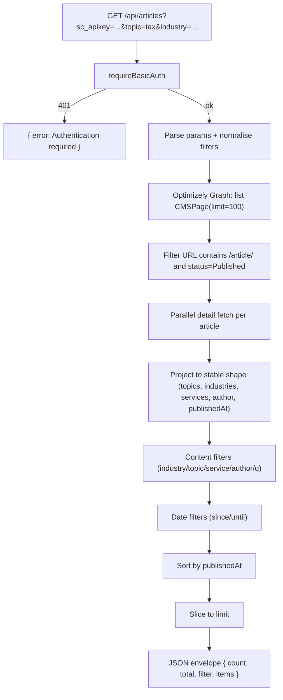

# Articles API — Filtering Guide

**Project:** Wipfli-style Next.js CMS
**Endpoint:** `GET /api/articles`
**File:** [`src/app/api/articles/route.ts`](../src/app/api/articles/route.ts)
**Auth:** Shared secret in `?sc_apikey=...` (see [`API_AUTHENTICATION.md`](./API_AUTHENTICATION.md))
**Status:** Shipped and verified in production
**Author:** Sharath K M

---

## 1. What this document covers

How to filter the `/api/articles` response by **keywords, industry, topic,
service, author, free-text and date**, and how the filtering is implemented
inside the route handler.

This mirrors the Wipfli pattern, e.g.:

```
https://www.wipfli.com/api/portal/insights
  ?sc_apikey={605F9C43-9467-4673-94E1-292DE67E8B81}
  &recordCount=7
  &industryName=Manufacturing%20and%20Distribution
```

Our equivalent:

```
https://project-coral-eight.vercel.app/api/articles
  ?sc_apikey=YOUR_SECRET
  &limit=7
  &industry=manufacturing-and-distribution
```

---

## 2. Supported query parameters

| Param | Type | Matches against | Match style | Default |
|---|---|---|---|---|
| `sc_apikey` | string | server secret | constant-time exact | — (required) |
| `limit` | int 1–100 | — | — | `20` |
| `order` | `asc` \| `desc` | `publishedAt` | — | `desc` |
| `locale` | `en` \| `es` | Optimizely locale | safelist | `en` |
| `since` | ISO date | `publishedAt` | inclusive lower bound | none |
| `until` | ISO date | `publishedAt` | inclusive upper bound | none |
| `industry` | string | `items[].industries[]` | exact, case-insensitive | none |
| `topic` | string | `items[].topics[]` | exact, case-insensitive | none |
| `service` | string | `items[].services[]` | exact, case-insensitive | none |
| `authorId` | string | `items[].authorId` | exact, case-insensitive | none |
| `author` | string | `items[].authorName` | substring, case-insensitive | none |
| `q` | string | header + description + author + topics + industries + services | substring, case-insensitive | none |

All filters combine with **AND**. Within an array field (topics/industries/services)
the match is **OR** — the article matches if *any* value in the array equals the
filter.

---

## 3. Where the filter values come from

The fields exposed on each item are projected from the Optimizely Graph
response in **Step 3** of the route:

| Response field | Source in Optimizely |
|---|---|
| `topics` | `keywords` (split on `,` `;` `\n`) |
| `industries` | `_json.relatedIndustryIds` |
| `services` | `_json.relatedServiceIds` |
| `authorId` | `_json.authorId` (or keyword metadata) |
| `authorName` | `_json.authorName` (or keyword metadata) |
| `publishedAt` | fallback chain: `_json.publishedAt` → `_metadata.published` → `lastModified` → `created` |

> **Important:** filter values must match the **stored slug**, not the display
> name. If a CMS keyword reads `Manufacturing and Distribution`, the stored
> value in `industries[]` may be `manufacturing-and-distribution`. Always call
> the endpoint **without** a filter first, copy a value from `items[].industries`
> (or `topics` / `services`) verbatim, then filter with that.

---

## 4. Example requests

Replace `KEY` with the value of `API_ACCESS_KEY`.

```text
# 1. Wipfli equivalent — 7 items, manufacturing
/api/articles?sc_apikey=KEY&limit=7&industry=manufacturing-and-distribution

# 2. Single topic = tax
/api/articles?sc_apikey=KEY&topic=tax

# 3. Single service = audit, 5 items
/api/articles?sc_apikey=KEY&service=audit&limit=5

# 4. Author by ID (exact)
/api/articles?sc_apikey=KEY&authorId=auth_123

# 5. Author by name (substring — "jane" matches "Jane Doe")
/api/articles?sc_apikey=KEY&author=jane

# 6. Free-text search across header, description, topics, industries, services, author
/api/articles?sc_apikey=KEY&q=cybersecurity
/api/articles?sc_apikey=KEY&q=manufacturing

# 7. Date window (inclusive)
/api/articles?sc_apikey=KEY&since=2026-05-01&until=2026-05-31

# 8. Combined filters (industry AND topic AND locale)
/api/articles?sc_apikey=KEY&industry=manufacturing-and-distribution&topic=tax&locale=es

# 9. Locale fallback — unknown locale silently falls back to en
/api/articles?sc_apikey=KEY&locale=fr   → response includes localeFellBack:true
```

---

## 5. Response envelope

```json
{
  "count": 7,
  "total": 12,
  "locale": "en",
  "requestedLocale": "en",
  "localeFellBack": false,
  "order": "desc",
  "limit": 7,
  "filter": {
    "industry": "manufacturing-and-distribution",
    "topic": null,
    "service": null,
    "authorId": null,
    "author": null,
    "q": null,
    "since": null,
    "until": null
  },
  "supportedLocales": ["en", "es"],
  "generatedAt": "2026-06-09T12:00:00.000Z",
  "items": [ ... ]
}
```

- `count` — number of items returned after slicing to `limit`.
- `total` — number of items matched by the filters **before** the limit. Use this
  to tell whether your filter is too narrow.
- `filter` — the parsed, normalised filter values echoed back. Useful for
  client-side debugging.
- `localeFellBack` / `requestedLocale` — tell the caller the locale was not
  supported and what they asked for.

---

## 6. How filtering is implemented

### 6.1 Auth guard (first two lines of the handler)

```ts
const unauthorized = requireBasicAuth(request, "Articles API");
if (unauthorized) return unauthorized;
```

The guard lives in [`src/lib/api-auth.ts`](../src/lib/api-auth.ts):

- Reads server secret from `API_ACCESS_KEY` (fallback `API_BASIC_AUTH_PASSWORD`).
- Reads `sc_apikey` from the request URL.
- Compares using `crypto.timingSafeEqual` (constant-time).
- Returns `401` JSON on mismatch, `503` JSON if no secret is configured.

### 6.2 Parse + normalise filters

```ts
function normalizeFilterValue(value: string | null | undefined): string | null {
  const normalized = (value ?? "").trim().toLowerCase();
  return normalized || null;
}

const industryFilter = normalizeFilterValue(url.searchParams.get("industry"));
const topicFilter    = normalizeFilterValue(url.searchParams.get("topic"));
const serviceFilter  = normalizeFilterValue(url.searchParams.get("service"));
const authorIdFilter = normalizeFilterValue(url.searchParams.get("authorId"));
const authorFilter   = normalizeFilterValue(url.searchParams.get("author"));
const queryFilter    = normalizeFilterValue(url.searchParams.get("q"));
```

Every filter goes through the same normaliser → trims whitespace, lowercases,
returns `null` for empty strings. Means `?topic=Tax`, `?topic=tax `, `?topic=TAX`
all behave identically.

### 6.3 Match helpers

```ts
function matchesFilter(values: string[], filter: string | null) {
  if (!filter) return true;                       // no filter → pass
  return values.some(v => normalizeFilterValue(v) === filter);   // OR within array
}

function includesText(value: string | null | undefined, query: string | null) {
  if (!query) return true;
  return normalizeFilterValue(value)?.includes(query) ?? false;
}
```

- `matchesFilter` — exact match against any item in an array (used for
  `industry`, `topic`, `service`).
- `includesText` — substring match (used for `author`, `q`).

### 6.4 Content filter pass (Step 4)

```ts
const contentFiltered = projected.filter((article) => {
  if (!matchesFilter(article.industries, industryFilter)) return false;
  if (!matchesFilter(article.topics, topicFilter)) return false;
  if (!matchesFilter(article.services, serviceFilter)) return false;
  if (authorIdFilter && normalizeFilterValue(article.authorId) !== authorIdFilter) return false;
  if (authorFilter && !includesText(article.authorName, authorFilter)) return false;

  if (queryFilter) {
    const searchableParts = [
      article.header,
      article.description,
      article.authorName,
      article.authorId,
      ...article.topics,
      ...article.industries,
      ...article.services,
    ];
    const hasQueryMatch = searchableParts.some(v => includesText(v, queryFilter));
    if (!hasQueryMatch) return false;
  }

  return true;
});
```

Combination rule: every active filter must pass → **AND** across filters,
**OR** inside an array field.

### 6.5 Date filter pass (Step 5)

```ts
const dateFiltered = contentFiltered.filter((a) => {
  if (sinceMs !== null && (a.publishedAtMs === null || a.publishedAtMs < sinceMs)) return false;
  if (untilMs !== null && (a.publishedAtMs === null || a.publishedAtMs > untilMs)) return false;
  return true;
});
```

`since` / `until` are inclusive. Articles whose `publishedAt` could not be
parsed are excluded when either bound is set.

### 6.6 Sort + slice (Steps 6–7)

```ts
const sorted = [...dateFiltered].sort((a, b) => {
  if (a.publishedAtMs === null && b.publishedAtMs === null) return 0;
  if (a.publishedAtMs === null) return 1;     // undated sinks to bottom
  if (b.publishedAtMs === null) return -1;
  return order === "asc" ? a.publishedAtMs - b.publishedAtMs : b.publishedAtMs - a.publishedAtMs;
});

const items = sorted.slice(0, limit).map(({ publishedAtMs, ...rest }) => rest);
```

The internal `publishedAtMs` field is stripped before returning.

---

## 7. Pipeline diagram



---

## 8. Behaviour matrix

| Scenario | Behaviour |
|---|---|
| No filters | All Published articles for `locale`, newest first |
| Filter matches nothing | `200` with `items: []`, `count: 0`, `total: 0` |
| Filter value has wrong case | Still matches (normaliser lowercases both sides) |
| Filter value has trailing whitespace | Still matches (normaliser trims) |
| Multiple values in one filter (`topic=tax,audit`) | Treated as a single literal `"tax,audit"` → likely zero matches |
| Unknown `locale` (e.g. `fr`) | Silently falls back to `en`; `localeFellBack: true` |
| Bad `since` / `until` | Filter silently ignored (`Date.parse` returns `NaN`) |
| Missing or wrong `sc_apikey` | `401` JSON with `hint` |
| Missing `API_ACCESS_KEY` server-side | `503` JSON, fail closed |
| Missing `OPTIMIZELY_RENDER_URL` / `_KEY` | `503` JSON `Optimizely not configured` |
| Optimizely Graph non-2xx | `502` JSON with upstream status |

---

## 9. Known limitations & extension points

1. **No multi-value filters.** `?topic=tax,audit` is treated as a single string.
   To support OR, change `normalizeFilterValue` to return `string[]` and update
   `matchesFilter` to test `filters.some(f => values.includes(f))`.
2. **No pagination cursor.** The endpoint always returns the top `limit`
   matches. If pagination is needed, add `?offset=` and apply it before
   `slice(0, limit)`.
3. **No server-side cache.** `dynamic = "force-dynamic"` is set deliberately so
   webhook-driven publishes are visible immediately. Add `revalidate` if you
   want short-lived caching.
4. **Filters are applied in-memory.** All 100 article details are fetched
   regardless of the filter. If the article corpus grows past a few hundred,
   move the filter into the Optimizely Graph query itself.

---

## 10. Quick reference — copy/paste demo URLs

```text
# Authenticated, no filter
/api/articles?sc_apikey=KEY

# Authenticated, Wipfli-style manufacturing top 7
/api/articles?sc_apikey=KEY&limit=7&industry=manufacturing-and-distribution

# Topic = tax
/api/articles?sc_apikey=KEY&topic=tax

# Service = audit
/api/articles?sc_apikey=KEY&service=audit

# Free-text
/api/articles?sc_apikey=KEY&q=cybersecurity

# Date window
/api/articles?sc_apikey=KEY&since=2026-05-01&until=2026-05-31

# Spanish, 5 items
/api/articles?sc_apikey=KEY&locale=es&limit=5

# Unauthorised — proves the guard works
/api/articles?sc_apikey=wrong
/api/articles
```

---

**See also**

- [`API_AUTHENTICATION.md`](./API_AUTHENTICATION.md) — how `?sc_apikey=` is validated
- [`ARTICLES_API.md`](./ARTICLES_API.md) — full endpoint contract & response shape
- [`WEBHOOK_PUBLISHED_FILTERING.md`](./WEBHOOK_PUBLISHED_FILTERING.md) — why `dynamic = "force-dynamic"` is safe
