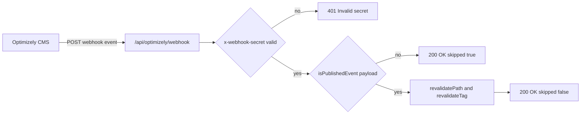
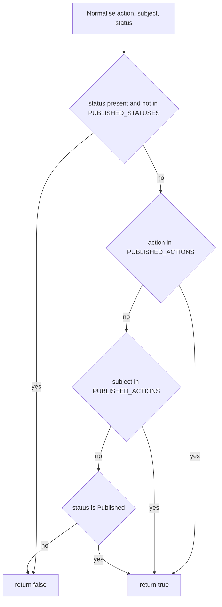
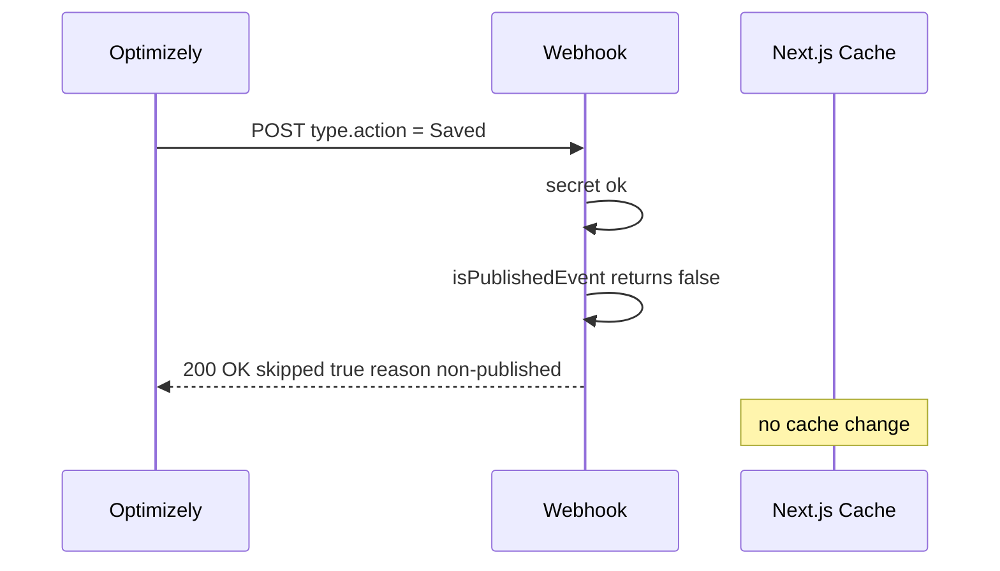
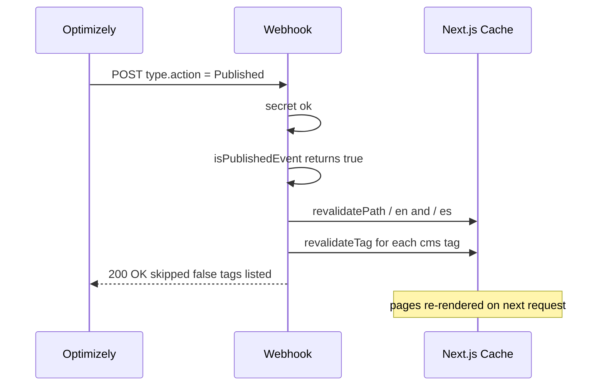
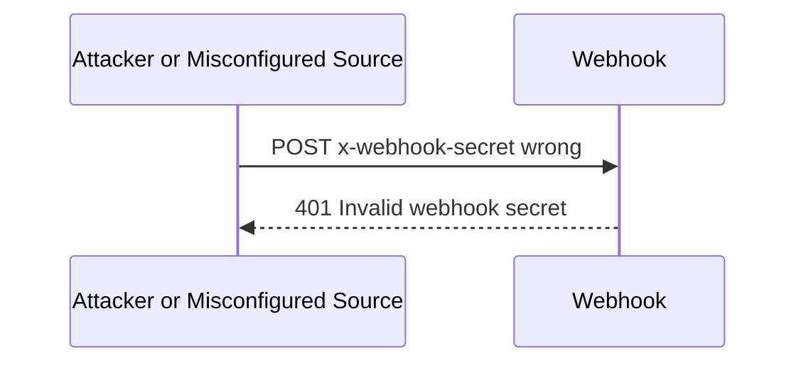

# Optimizely Webhook — Published-Only Filtering

**Project:** Wipfli-style Next.js CMS
**Endpoint:** `POST /api/optimizely/webhook`
**File:** `src/app/api/optimizely/webhook/route.ts`
**Status:** Shipped (commit `345d7eb`)
**Author:** Sharath K M

---

## 1. Problem statement

Optimizely fires webhooks for **every** content lifecycle event — drafts being
saved, content being checked out, items being moved, deletions, plus the actual
publish events.

Our public site only needs to react when content goes **Published**:

- A draft being saved must NOT trigger Next.js cache revalidation
- A `CheckedOut` event must NOT trigger revalidation
- Deletions and moves must NOT trigger revalidation
- A `Published` (or `ContentVersionPublished`) event MUST trigger revalidation

Before the filter, every editor keystroke caused a full cache wipe — wasteful,
noisy in logs, and produced inconsistent previews because draft saves were
treated the same as a real publish.

---

## 2. Goals

| # | Goal |
|---|---|
| 1 | Only revalidate Next.js cache on **Published** events |
| 2 | Always return `200 OK` to Optimizely so it does not retry skipped events |
| 3 | Be explicit in the response why a request was skipped (auditability) |
| 4 | Continue to authenticate the webhook with a shared secret |
| 5 | Be resilient to Optimizely sending the publish info in different shapes (`type.action`, `type.subject`, top-level `status`, `data.status`) |

---

## 3. High-level flow



---

## 4. Step-by-step implementation

### Step 1 — Define the allow-lists

Optimizely is inconsistent across event sources, so we normalise both the
action and subject fields and check membership in a small set.

```ts
const PUBLISHED_ACTIONS = new Set([
  "published",
  "publish",
  "contentpublished",
  "contentversionpublished",
]);

const PUBLISHED_STATUSES = new Set(["published", "publish"]);

function normalize(value: string | undefined | null): string {
  return (value ?? "").trim().toLowerCase();
}
```

**Why a Set?** O(1) membership check, intent is clear, easy to extend.

### Step 2 — Decide whether the event is a publish

A single predicate combines all the signals Optimizely might send:

```ts
function isPublishedEvent(payload: OptimizelyWebhookPayload): boolean {
  const action = normalize(payload.type?.action);
  const subject = normalize(payload.type?.subject);
  const status = normalize(
    (payload as { status?: string; data?: { status?: string } }).status ??
      (payload as { data?: { status?: string } }).data?.status,
  );

  if (status && !PUBLISHED_STATUSES.has(status)) return false;
  if (action && PUBLISHED_ACTIONS.has(action)) return true;
  if (subject && PUBLISHED_ACTIONS.has(subject)) return true;
  return status ? PUBLISHED_STATUSES.has(status) : false;
}
```

Decision logic, in order:



### Step 3 — Authenticate the request

```ts
const expectedSecret = process.env.REVALIDATE_SECRET ?? "local-revalidate-secret";
const providedSecret =
  request.headers.get("x-webhook-secret") ?? new URL(request.url).searchParams.get("secret");

if (providedSecret !== expectedSecret) {
  return NextResponse.json({ message: "Invalid webhook secret." }, { status: 401 });
}
```

Both header and query-string are accepted because Optimizely's test tools use
the query string while production sends a header.

### Step 4 — Skip non-publish events with a 200

Returning 200 (not 4xx) tells Optimizely "I got it, do not retry". The body
explains why we skipped — useful in their delivery log.

```ts
if (!isPublishedEvent(payload)) {
  return NextResponse.json({
    ok: true,
    skipped: true,
    reason: "non-published event ignored",
    eventId, subject, action,
  });
}
```

### Step 5 — Revalidate on real publish

```ts
const tags = getOptimizelyRevalidationTags();

revalidatePath("/");
revalidatePath("/en");
revalidatePath("/es");

for (const tag of tags) {
  revalidateTag(tag, { expire: 0 });
}

return NextResponse.json({
  ok: true,
  skipped: false,
  eventId, subject, action, tags,
});
```

We hit both the locale roots and every tag the CMS layer knows about, so the
cache is fully purged for the freshly-published content.

---

## 5. Request lifecycle

### A. Draft save (skipped)



### B. Real publish (revalidated)



### C. Bad secret (rejected)



---

## 6. Sample requests and responses

### Skipped (draft save)

Request:
```json
{
  "id": "evt_12345",
  "type": { "subject": "Content", "action": "Saved" },
  "data": { "key": "abc-def", "status": "Draft" }
}
```

Response (HTTP 200):
```json
{
  "ok": true,
  "skipped": true,
  "reason": "non-published event ignored",
  "eventId": "evt_12345",
  "subject": "Content",
  "action": "Saved"
}
```

### Accepted (publish)

Request:
```json
{
  "id": "evt_99999",
  "type": { "subject": "Content", "action": "Published" },
  "data": { "key": "abc-def", "status": "Published" }
}
```

Response (HTTP 200):
```json
{
  "ok": true,
  "skipped": false,
  "eventId": "evt_99999",
  "subject": "Content",
  "action": "Published",
  "tags": ["optimizely:cmspage", "optimizely:startpage", "optimizely:header"]
}
```

### Bad secret

Response (HTTP 401):
```json
{ "message": "Invalid webhook secret." }
```

---

## 7. Why we return 200 on skipped events

Webhook providers (including Optimizely) treat any non-2xx response as a
delivery failure and **retry** with exponential backoff. If we returned 4xx for
draft events, Optimizely would keep hammering us with the same useless event.

By returning 200 with `skipped: true`, we:

- Acknowledge the event so Optimizely stops retrying
- Keep a clear audit trail in the response body
- Don't waste Next.js revalidation cycles

---

## 8. Configuration

| Env var | Required | Purpose |
|---|---|---|
| `REVALIDATE_SECRET` | yes (prod) | Shared secret webhook senders must provide |

Set in Optimizely:
- Webhook URL: `https://project-coral-eight.vercel.app/api/optimizely/webhook`
- Header: `x-webhook-secret: <REVALIDATE_SECRET>`
- Subscribe only to **Content** events (other subjects are ignored anyway)

---

## 9. Testing

### Local
```powershell
curl -X POST `
  -H "Content-Type: application/json" `
  -H "x-webhook-secret: local-revalidate-secret" `
  -d '{ "id":"t1", "type":{ "subject":"Content","action":"Saved" } }' `
  http://localhost:3000/api/optimizely/webhook
```
Expect `skipped: true`.

```powershell
curl -X POST `
  -H "Content-Type: application/json" `
  -H "x-webhook-secret: local-revalidate-secret" `
  -d '{ "id":"t2", "type":{ "subject":"Content","action":"Published" } }' `
  http://localhost:3000/api/optimizely/webhook
```
Expect `skipped: false` and the page cache to refresh.

### Production
Publish any article from the Optimizely CMS UI; verify in the Vercel function
logs that exactly **one** revalidation runs per publish, and zero for draft
saves.

---

## 10. Security properties

| Concern | Mitigation |
|---|---|
| Unauthorised cache flushing | `x-webhook-secret` checked first, before any payload parsing |
| Retry storms from misclassified events | Always 200 OK for known-but-skipped events |
| Payload shape drift | Multiple signals consulted (action / subject / status) |
| Case / whitespace inconsistency | `normalize()` lowercases and trims every field |

---

## 11. Future enhancements (not in scope)

- HMAC-signed payloads (when Optimizely supports it)
- Per-content-type tag invalidation (currently all known tags are flushed)
- Structured logging to a SIEM
- Replay protection via event-id deduplication store

---

## 12. Summary

- Webhook now ignores draft, saved, checked-out, deleted, moved events
- Real publishes trigger one revalidation pass across paths + CMS tags
- Skipped events return 200 with explicit `skipped: true` and reason
- Secret-protected via `x-webhook-secret` header or `?secret=` query string
- Fully resilient to the three places Optimizely puts the publish signal
